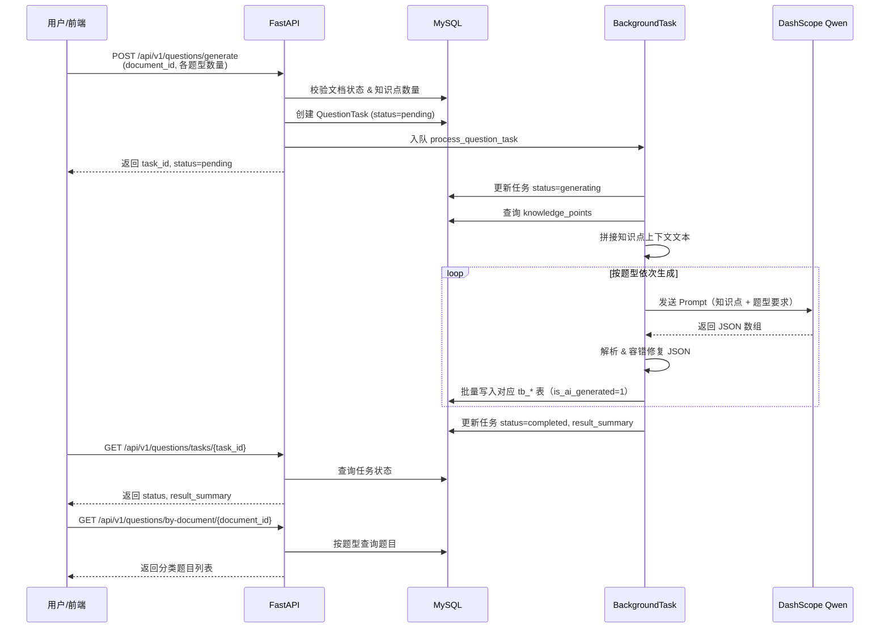
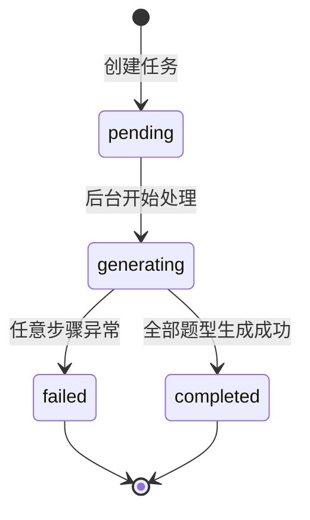
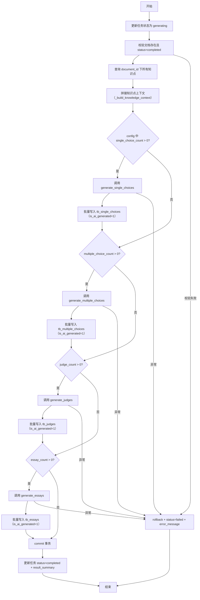
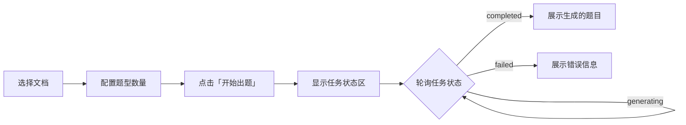

# AI 出题功能设计文档

> 版本：v1.0  
> 最后更新：2026-02-13  
> 状态：已实现

---

## 1. 概述

### 1.1 业务场景

本功能服务于企业内部考试平台。用户上传党建相关的规章制度、红头文件、学习文件等文档后，系统先解析文档并抽取知识点，再基于这些知识点自动生成考试题目。生成的题目存入 MySQL 题库表，供考试系统直接调用组卷。

### 1.2 支持题型

| 题型 | 存储表 | 说明 |
|------|--------|------|
| 单选题 | `tb_single_choices` | 4 个选项（A/B/C/D），单一正确答案；AI 生题时 `is_ai_generated=1` |
| 多选题 | `tb_multiple_choices` | 4 或 5 个选项（可配），2 个及以上正确答案；AI 生题时 `is_ai_generated=1` |
| 判断题 | `tb_judges` | 正确（1）或错误（0）；AI 生题时 `is_ai_generated=1` |
| 简答题 | `tb_essays` | 参考答案 + 评分得分点（scoring_rule）；AI 生题时 `is_ai_generated=1` |

### 1.3 技术栈

- **后端框架**：FastAPI（Python 3.10+）
- **数据库**：MySQL + SQLAlchemy ORM
- **大语言模型**：阿里云 DashScope（Qwen 系列，如 qwen3.5-plus）
- **异步处理**：FastAPI BackgroundTasks
- **JSON 容错**：json-repair 库
- **前端调试页**：原生 HTML + Tailwind CSS + JavaScript

---

## 2. 架构与数据流

### 2.1 系统依赖关系

```
documents（文档表）
    │
    ├──→ knowledge_points（知识点表）
    │         │
    │         └──→ [LLM 出题] ──→ tb_single_choices
    │                           ──→ tb_multiple_choices
    │                           ──→ tb_judges
    │                           ──→ tb_essays
    │
    └──→ question_tasks（出题任务跟踪表）
```

### 2.2 出题流程



### 2.3 任务状态机



---

## 3. 数据模型设计

### 3.1 已有题型表扩展

四张已有题型表均新增两个追溯列，用于关联题目来源：

| 列名 | 类型 | 约束 | 说明 |
|------|------|------|------|
| `document_id` | BIGINT | NULL, INDEX | 来源文档 ID |
| `task_id` | BIGINT | NULL, INDEX | 出题任务 ID |

> 设为 NULL 是因为已有存量数据没有这两个字段值。

#### 3.1.1 tb_single_choices（单选题）

| 字段 | 类型 | 说明 |
|------|------|------|
| id | INT, PK, AUTO_INCREMENT | 主键 |
| document_id | BIGINT, NULL | 来源文档 ID |
| task_id | BIGINT, NULL | 出题任务 ID |
| question_text | TEXT, NOT NULL | 题目内容 |
| option_a | TEXT, NOT NULL | 选项 A |
| option_b | TEXT, NOT NULL | 选项 B |
| option_c | TEXT, NOT NULL | 选项 C |
| option_d | TEXT, NOT NULL | 选项 D |
| correct_answer | VARCHAR(1), NOT NULL | 正确答案：A/B/C/D |
| explanation | TEXT, NULL | 答案解析 |
| score | INT, NOT NULL, DEFAULT 10 | 题目分值 |
| review_status | SMALLINT, NOT NULL, DEFAULT 0 | 审核状态：0 待审核 / 1 通过 / 2 不通过 |
| is_ai_generated | TINYINT(1), NOT NULL, DEFAULT 0 | 是否为 AI 生题：0 否 / 1 是 |
| created_at | DATETIME | 创建时间 |
| updated_at | DATETIME | 更新时间 |

#### 3.1.2 tb_multiple_choices（多选题）

| 字段 | 类型 | 说明 |
|------|------|------|
| id | INT, PK, AUTO_INCREMENT | 主键 |
| document_id | BIGINT, NULL | 来源文档 ID |
| task_id | BIGINT, NULL | 出题任务 ID |
| question_text | TEXT, NOT NULL | 题目内容 |
| option_a | TEXT, NOT NULL | 选项 A |
| option_b | TEXT, NOT NULL | 选项 B |
| option_c | TEXT, NOT NULL | 选项 C |
| option_d | TEXT, NOT NULL | 选项 D |
| option_e | TEXT | 选项 E（4 选项时为空字符串） |
| correct_answer | VARCHAR(20), NOT NULL | 正确答案，逗号分隔，如 "A,B,D" |
| explanation | TEXT, NULL | 答案解析 |
| score | INT, NOT NULL, DEFAULT 10 | 题目分值 |
| review_status | SMALLINT, NOT NULL, DEFAULT 0 | 审核状态 |
| is_ai_generated | TINYINT(1), NOT NULL, DEFAULT 0 | 是否为 AI 生题：0 否 / 1 是 |
| created_at | DATETIME | 创建时间 |
| updated_at | DATETIME | 更新时间 |

#### 3.1.3 tb_judges（判断题）

| 字段 | 类型 | 说明 |
|------|------|------|
| id | INT, PK, AUTO_INCREMENT | 主键 |
| document_id | BIGINT, NULL | 来源文档 ID |
| task_id | BIGINT, NULL | 出题任务 ID |
| question_text | TEXT, NOT NULL | 题目内容 |
| correct_answer | SMALLINT, NOT NULL | 正确答案：1 正确 / 0 错误 |
| explanation | TEXT, NULL | 答案解析 |
| score | INT, NOT NULL, DEFAULT 5 | 题目分值 |
| review_status | SMALLINT, NOT NULL, DEFAULT 0 | 审核状态 |
| is_ai_generated | TINYINT(1), NOT NULL, DEFAULT 0 | 是否为 AI 生题：0 否 / 1 是 |
| created_at | DATETIME | 创建时间 |
| updated_at | DATETIME | 更新时间 |

#### 3.1.4 tb_essays（简答题）

| 字段 | 类型 | 说明 |
|------|------|------|
| id | INT, PK, AUTO_INCREMENT | 主键 |
| document_id | BIGINT, NULL | 来源文档 ID |
| task_id | BIGINT, NULL | 出题任务 ID |
| question_text | TEXT, NOT NULL | 题目内容 |
| reference_answer | TEXT, NOT NULL | 参考答案 |
| scoring_rule | TEXT, NULL | 评分规则 JSON |
| score | INT, NOT NULL, DEFAULT 20 | 题目分值 |
| review_status | SMALLINT, NOT NULL, DEFAULT 0 | 审核状态 |
| is_ai_generated | TINYINT(1), NOT NULL, DEFAULT 0 | 是否为 AI 生题：0 否 / 1 是 |
| created_at | DATETIME | 创建时间 |
| updated_at | DATETIME | 更新时间 |

**scoring_rule 结构示例**：

```json
[
  {"point": "深入构建中建一局155大党建工作格局", "weight": 1},
  {"point": "学习宣传和贯彻落实党的理论和路线方针政策", "weight": 1},
  {"point": "做好党员教育、管理、监督、服务和发展党员工作", "weight": 2},
  {"point": "强化人才队伍建设，培养骨干人才", "weight": 1}
]
```

### 3.2 新建表：question_tasks（出题任务跟踪）

| 字段 | 类型 | 说明 |
|------|------|------|
| id | BIGINT, PK, AUTO_INCREMENT | 主键 |
| document_id | BIGINT, NOT NULL, INDEX | 关联文档 ID |
| status | VARCHAR(32), NOT NULL, DEFAULT 'pending' | 任务状态：pending / generating / completed / failed |
| config | TEXT, NULL | 题型数量配置 JSON |
| error_message | TEXT, NULL | 失败错误信息 |
| result_summary | TEXT, NULL | 生成结果摘要 JSON |
| created_at | DATETIME, NOT NULL | 创建时间 |
| updated_at | DATETIME, NOT NULL | 更新时间（ON UPDATE） |

**config 示例**：

```json
{
  "single_choice_count": 5,
  "multiple_choice_count": 5,
  "multiple_choice_options": 4,
  "judge_count": 5,
  "essay_count": 2
}
```

**result_summary 示例**：

```json
{
  "single_choice": 5,
  "multiple_choice": 5,
  "judge": 5,
  "essay": 2
}
```

### 3.3 数据库迁移

迁移脚本位于 `knowledge_service/migrate_questions.sql`，包含：

1. 四条 `ALTER TABLE ... ADD COLUMN ... ADD INDEX` 语句，为 `ai_tb_single_choices`、`ai_tb_multiple_choices`、`ai_tb_judges`、`ai_tb_essays` 各添加 `document_id` 和 `task_id` 列及索引。
2. 一条 `CREATE TABLE IF NOT EXISTS question_tasks` 语句。

> 需使用具有 ALTER / CREATE 权限的 MySQL 账号手动执行，应用层 `aipi_user` 通常无此权限。

---

## 4. API 设计

所有接口挂载在 `/api/v1/questions` 路径下。

### 4.1 创建出题任务

```
POST /api/v1/questions/generate
```

**请求体**（JSON）：

| 字段 | 类型 | 默认值 | 范围 | 说明 |
|------|------|--------|------|------|
| document_id | int | 必填 | - | 文档 ID（必须已解析完成） |
| single_choice_count | int | 5 | 0-50 | 单选题数量 |
| multiple_choice_count | int | 5 | 0-50 | 多选题数量 |
| multiple_choice_options | int | 4 | 4-5 | 多选题选项数 |
| judge_count | int | 5 | 0-50 | 判断题数量 |
| essay_count | int | 2 | 0-20 | 简答题数量 |

**校验规则**：
- 文档必须存在且 `status = completed`
- 文档下必须有已解析的知识点
- 至少一种题型数量 > 0

**响应**（200）：

```json
{
  "task_id": 1,
  "status": "pending",
  "message": "出题任务已创建，共需生成 17 道题目（基于 8 个知识点）"
}
```

**副作用**：创建 `QuestionTask` 记录，并将 `process_question_task` 加入 BackgroundTasks 队列。

### 4.2 查询任务状态

```
GET /api/v1/questions/tasks/{task_id}
```

**响应**：

```json
{
  "id": 1,
  "document_id": 9,
  "status": "completed",
  "config": "{\"single_choice_count\": 5, ...}",
  "result_summary": "{\"single_choice\": 5, \"multiple_choice\": 5, ...}",
  "error_message": null,
  "created_at": "2026-02-13T10:00:00",
  "updated_at": "2026-02-13T10:02:30"
}
```

### 4.3 任务列表

```
GET /api/v1/questions/tasks?document_id=9&skip=0&limit=50
```

**查询参数**：
- `document_id`（可选）：按文档筛选
- `skip`：偏移量，默认 0
- `limit`：每页数量，默认 50，最大 200

**响应**：

```json
{
  "total": 3,
  "items": [ ... ]
}
```

### 4.4 查询文档已生成题目

```
GET /api/v1/questions/by-document/{document_id}
```

**响应**：按题型分类返回该文档下所有已生成题目。

```json
{
  "document_id": 9,
  "single_choices": [ ... ],
  "multiple_choices": [ ... ],
  "judges": [ ... ],
  "essays": [ ... ]
}
```

---

## 5. LLM 出题服务设计

### 5.1 服务位置

`knowledge_service/app/services/question_generator.py`

### 5.2 LLM 调用约定

| 项目 | 说明 |
|------|------|
| 模型 | 由 `.env` 中 `LLM_MODEL` 配置，如 `qwen3.5-plus` |
| API | DashScope `MultiModalConversation.call()` |
| 系统角色 | "企业党建领域的考试命题专家" |
| 输出约束 | 仅输出 JSON，不输出解释性文字 |
| 引号处理 | JSON 字符串值中的 ASCII 双引号须用中文直角引号「」替代 |

### 5.3 JSON 容错机制

LLM 输出的 JSON 可能存在格式问题（未转义引号、多余逗号等），采用两级容错：

```
LLM 原始输出
    │
    ├─ 1. 提取 JSON 片段（匹配 ```json...``` 代码块或 [...] 数组）
    │
    ├─ 2. json.loads() 标准解析
    │      ├─ 成功 → 返回结果
    │      └─ 失败 ↓
    │
    └─ 3. json_repair.repair_json() 容错修复
           ├─ 成功 → 返回修复后的结果
           └─ 失败 → 抛出 ValueError
```

### 5.4 各题型 Prompt 设计要点

#### 单选题

- 4 个选项（A/B/C/D），唯一正确答案
- 覆盖知识点中的关键信息（数字、定义、流程、职责、原则等）
- 干扰选项具有迷惑性但不与正确答案含义相同
- 附带答案解析

**输出字段**：`question_text`, `option_a`, `option_b`, `option_c`, `option_d`, `correct_answer`, `explanation`

#### 多选题

- 选项数由入参控制（4 或 5 个）
- 正确答案 >= 2 个，以逗号分隔大写字母表示（如 "A,B,D"）
- 考查需要综合理解的内容
- 解析说明每个正确选项的依据

**输出字段**：`question_text`, `option_a` ~ `option_d`（+ `option_e`），`correct_answer`, `explanation`

#### 判断题

- 答案为正确（1）或错误（0）
- 正确与错误题目数量大致均衡
- 错误题目基于知识点进行合理的细节篡改（修改数字、调换概念、颠倒因果等）
- 解析指出错误题目的具体错误之处

**输出字段**：`question_text`, `correct_answer`, `explanation`

#### 简答题

- 考查理解、归纳和阐述能力
- 参考答案完整准确，覆盖所有要点
- scoring_rule 为得分点数组，每项含 `point`（要点描述）和 `weight`（分值权重），所有 weight 之和建议为该题总分
- 难度适中，兼顾记忆与理解

**输出字段**：`question_text`, `reference_answer`, `scoring_rule`

### 5.5 写入兼容处理

- **多选题 option_e**：当生成 4 选项多选题时，LLM 不返回 `option_e`。若数据库该列为 `NOT NULL`，写入时将 `None` 转为空字符串 `""`。
- **判断题 correct_answer**：LLM 可能返回布尔值 `true/false`，写入前统一转为整数 `1/0`。
- **简答题 scoring_rule**：LLM 返回的是 JSON 数组对象，写入前序列化为 JSON 字符串存储。

---

## 6. 后台任务设计

### 6.1 入口函数

`knowledge_service/app/tasks/question_tasks.py` 中的 `process_question_task(task_id, document_id, config)`

### 6.2 执行流程



### 6.3 知识点上下文构建

`_build_knowledge_context(kps)` 将知识点列表拼接为 LLM 可读的文本格式：

```
【知识点1】标题
  标签: 标签A, 标签B
  知识点正文内容...

【知识点2】标题
  知识点正文内容...
```

### 6.4 错误处理策略

- 任意步骤异常时执行 `db.rollback()`，已写入的题目全部回滚
- 更新任务状态为 `failed`，将异常信息写入 `error_message`
- 已成功生成的题型数量记录在 `result_summary` 中（部分成功场景）
- 不自动重试，用户可通过前端重新发起出题任务

### 6.5 日志记录

后台任务在关键节点输出详细日志：

| 节点 | 日志内容 |
|------|----------|
| 任务开始 | task_id、document_id、config |
| 知识点加载 | 知识点数量、上下文字符数 |
| 每题型生成前 | 题型名称、目标数量 |
| 每题型生成后 | 耗时、实际生成数量 |
| LLM 调用 | 模型名称、prompt 长度、响应耗时、状态码、响应长度 |
| JSON 解析 | 标准解析成功/失败、容错修复结果 |
| 任务完成 | result_summary、总耗时 |
| 任务失败 | 错误详情（含 traceback） |

---

## 7. 前端调试页

### 7.1 页面位置

`knowledge_service/static/generate.html`，通过 `/static/generate.html` 访问。

### 7.2 功能模块

| 模块 | 说明 |
|------|------|
| 文档选择 | 下拉列表，仅展示 `status=completed` 的文档，选中后显示知识点数量 |
| 题型配置 | 单选题、多选题、判断题、简答题数量输入框；多选题选项数下拉（4/5） |
| 出题按钮 | 校验配置后调用 `POST /generate`，获取 task_id |
| 任务状态 | 轮询 `GET /tasks/{task_id}`，实时展示任务进度与状态 |
| 题目展示 | 任务完成后调用 `GET /by-document/{document_id}`，按题型 Tab 分类展示 |
| 历史任务 | 展示该文档的历史出题任务列表 |

### 7.3 交互流程



---

## 8. 配置与依赖

### 8.1 环境变量

| 变量 | 说明 | 示例 |
|------|------|------|
| `DASHSCOPE_API_KEY` | 阿里云 DashScope API 密钥 | sk-xxx |
| `LLM_MODEL` | 大语言模型名称 | qwen3.5-plus |
| `MYSQL_HOST` | MySQL 主机 | 124.221.130.200 |
| `MYSQL_PORT` | MySQL 端口 | 3306 |
| `MYSQL_USER` | MySQL 用户名 | aipi_user |
| `MYSQL_PASSWORD` | MySQL 密码 | (配置于 .env) |
| `MYSQL_DATABASE` | MySQL 数据库名 | aipi |

> 出题功能与知识抽取功能共用 LLM 和 MySQL 配置。

### 8.2 Python 依赖

| 包名 | 用途 |
|------|------|
| `fastapi` | Web 框架 |
| `sqlalchemy` | ORM |
| `pymysql` | MySQL 驱动 |
| `dashscope` | DashScope LLM SDK |
| `json-repair` | JSON 容错解析 |
| `pydantic` / `pydantic-settings` | 数据校验与配置管理 |

---

## 9. 项目文件结构

```
knowledge_service/
├── app/
│   ├── api/
│   │   └── questions.py            # 出题 API 端点
│   ├── models/
│   │   └── question.py             # 题型 ORM 模型 + QuestionTask 模型
│   ├── schemas/
│   │   └── question.py             # Pydantic 请求/响应模型
│   ├── services/
│   │   └── question_generator.py   # LLM 出题服务（Prompt + 解析）
│   ├── tasks/
│   │   └── question_tasks.py       # 后台异步出题任务
│   ├── main.py                     # 路由注册（questions_router）
│   └── ...
├── static/
│   └── generate.html               # 前端出题调试页
├── migrate_questions.sql           # 数据库迁移脚本
└── ...
```

---

## 10. 设计决策与约束

| 决策 | 说明 |
|------|------|
| 复用已有表 | 历史方案：不新建题型表，复用平台已有的 `ai_tb_*` 表，仅增加 `document_id`、`task_id` 追溯列；当前实现写入 `tb_*` 正式题库表，并通过 `is_ai_generated` 标记 AI 生题 |
| 追溯列可空 | `document_id` 和 `task_id` 设为 `NULL`，兼容存量数据 |
| 多选题选项数可配 | 通过请求参数 `multiple_choice_options`（4 或 5）控制，Prompt 动态拼接 |
| option_e 兼容 | 若数据库 `option_e` 列为 NOT NULL，4 选项时写入空字符串 |
| scoring_rule 存储 | 简答题评分规则以 JSON 字符串形式存入 TEXT 列 |
| 异步不重试 | 出题任务为一次性异步执行，失败后不自动重试，用户可手动重新发起 |
| JSON 容错 | LLM 输出 JSON 可能格式不规范，采用 `json.loads` + `json_repair` 两级容错 |
| 引号规避 | Prompt 中要求 LLM 用中文直角引号「」替代 ASCII 双引号，降低 JSON 解析错误率 |
| 手动迁移 | 表结构变更通过 SQL 脚本手动执行，应用层用户通常无 DDL 权限 |

---

## 附录 A：迁移脚本摘要

```sql
-- 历史脚本（ai_tb_*）：为四张题型表添加追溯列
ALTER TABLE ai_tb_single_choices
    ADD COLUMN document_id BIGINT NULL AFTER id,
    ADD COLUMN task_id BIGINT NULL AFTER document_id,
    ADD INDEX idx_sc_document_id (document_id),
    ADD INDEX idx_sc_task_id (task_id);

-- ai_tb_multiple_choices、ai_tb_judges、ai_tb_essays 同理

-- 当前脚本（tb_*）：为正式题库表添加追溯列和 AI 标记列
ALTER TABLE tb_single_choices
    ADD COLUMN document_id BIGINT NULL AFTER id,
    ADD COLUMN task_id BIGINT NULL AFTER document_id,
    ADD COLUMN review_status SMALLINT NOT NULL DEFAULT 0 AFTER score,
    ADD COLUMN is_ai_generated TINYINT(1) NOT NULL DEFAULT 0 AFTER review_status;

-- tb_multiple_choices / tb_judges / tb_essays 同理，额外为 document_id / task_id 创建索引

-- 创建出题任务跟踪表
CREATE TABLE IF NOT EXISTS question_tasks (
    id BIGINT AUTO_INCREMENT PRIMARY KEY,
    document_id BIGINT NOT NULL,
    status VARCHAR(32) NOT NULL DEFAULT 'pending',
    config TEXT NULL,
    error_message TEXT NULL,
    result_summary TEXT NULL,
    created_at DATETIME NOT NULL DEFAULT CURRENT_TIMESTAMP,
    updated_at DATETIME NOT NULL DEFAULT CURRENT_TIMESTAMP ON UPDATE CURRENT_TIMESTAMP,
    INDEX idx_qt_document_id (document_id),
    INDEX idx_qt_status (status)
) ENGINE=InnoDB DEFAULT CHARSET=utf8mb4 COLLATE=utf8mb4_unicode_ci;
```

## 附录 B：Prompt 模板示例（单选题）

```text
请根据以下党建知识点内容，生成 5 道单选题。

## 要求
1. 每道题有且仅有 4 个选项（A/B/C/D），只有一个正确答案
2. 题目应覆盖知识点中的关键信息（数字、定义、流程、职责、原则等）
3. 干扰选项应具有一定迷惑性，但不能与正确答案含义相同
4. 答案解析应简明扼要，说明为何选此项

## 输出格式
严格以 JSON 数组返回，每个元素包含以下字段：
[
  {
    "question_text": "题目内容",
    "option_a": "选项A内容",
    "option_b": "选项B内容",
    "option_c": "选项C内容",
    "option_d": "选项D内容",
    "correct_answer": "A",
    "explanation": "答案解析"
  }
]

## 知识点内容
---
【知识点1】标题
  内容...
---

请生成 5 道单选题（仅输出 JSON 数组）：
```
