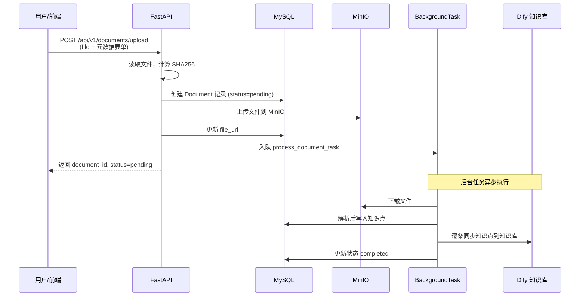
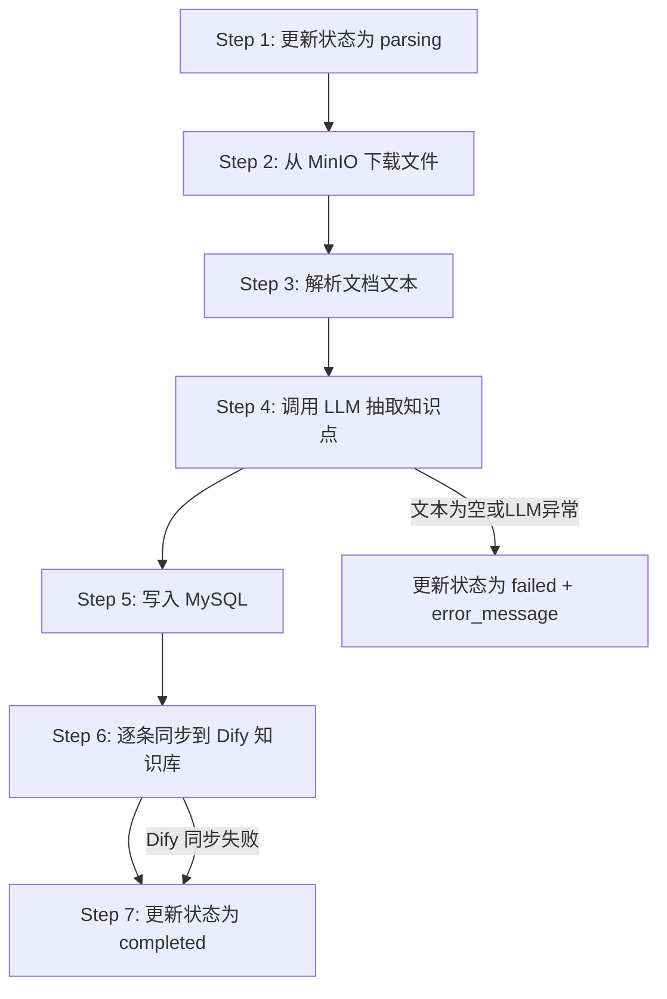
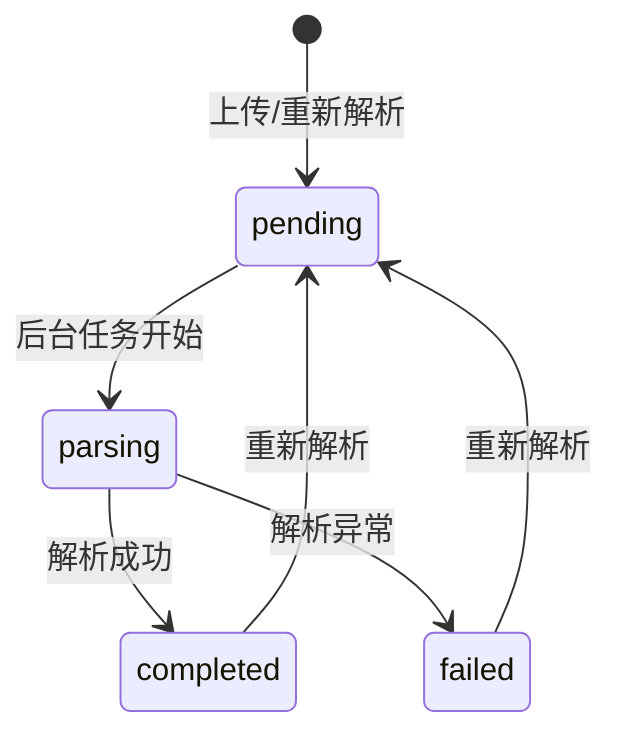
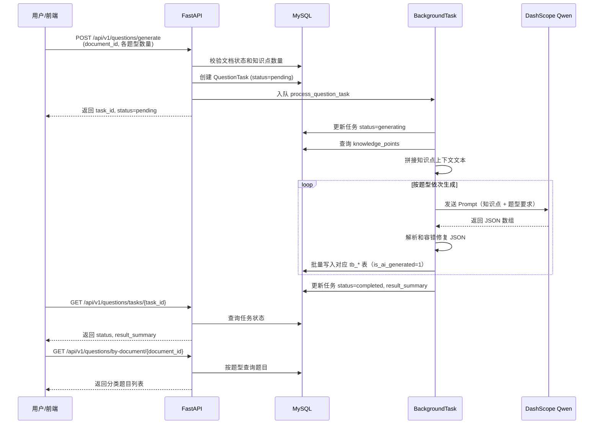
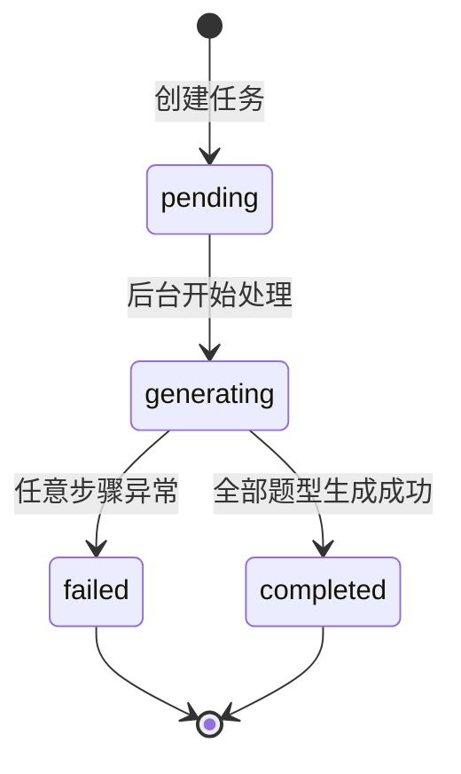
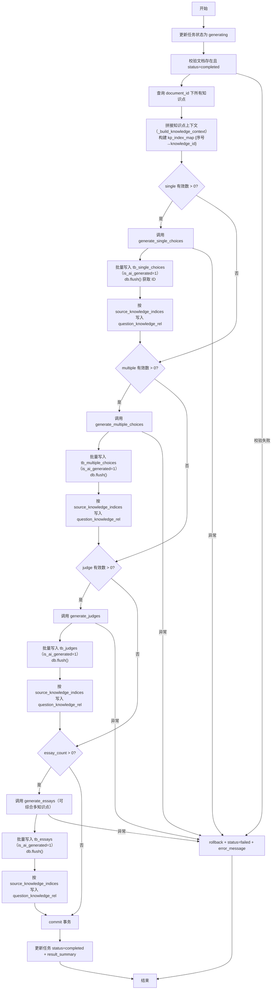
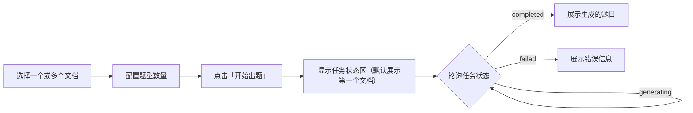
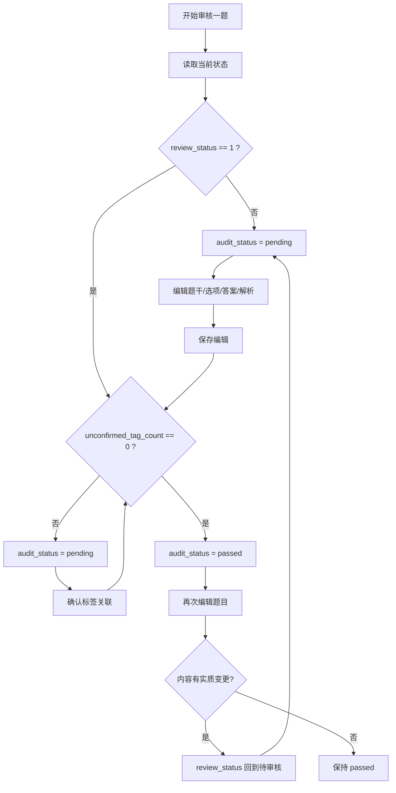
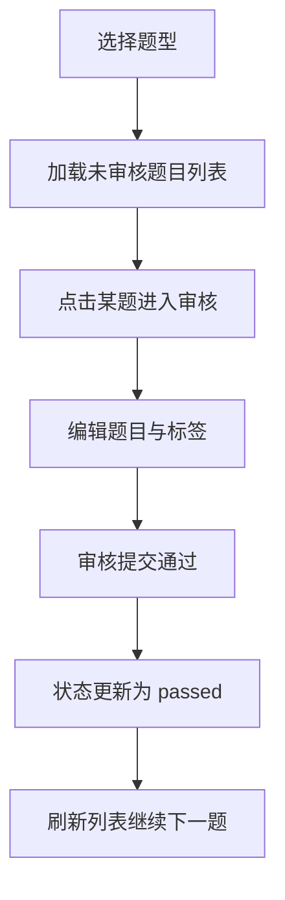

# 考试平台 AI 知识处理服务 — 设计文档

> 版本：v1.4
> 最后更新：2026-04-13
> 状态：已实现

---

## 目录

- [1. 概述](#1-概述)
- [2. 文档与知识点管道](#2-文档与知识点管道)
- [3. 数据模型](#3-数据模型)
- [4. API 设计](#4-api-设计)
- [5. AI 出题功能](#5-ai-出题功能)
- [6. 项目结构](#6-项目结构)
- [7. 部署与运维](#7-部署与运维)
- [8. 题目推荐与审核优化](#8-题目推荐与审核优化)
- [9. 岗位/级别标签 NLP 语义匹配](#9-岗位级别标签-nlp-语义匹配)
- [10. 基于错题的推荐与组卷](#10-基于错题的推荐与组卷)

---

## 1. 概述

### 1.1 服务定位

本服务是企业内部考试平台的 AI 知识处理后端，面向党建领域。用户上传党建相关的规章制度、红头文件、学习材料等文档后，系统自动完成：

1. **文档信息与元数据落库** — 文档名称、类型、领域、版本、文件信息、状态等元数据写入 **MySQL**（documents 表）
2. **实体文件存储** — 上传的 PDF/Word/TXT 等原始文件存入 **MinIO** 对象存储，便于后续下载解析
3. **文档解析** — 从 MinIO 拉取文件，按格式（PDF / Word / TXT）提取纯文本
4. **知识点抽取** — 调用大语言模型（LLM）将文本拆解为结构化知识点
5. **知识点落库** — 抽取结果（标题、内容、摘要、标签、重要度等）写入 **MySQL**（knowledge_points、tags、knowledge_tag_rel 表）
6. **RAG 知识库同步** — 将知识点同步写入 **Dify** 知识库，供检索增强生成使用
7. **AI 自动出题** — 基于已落库的知识点，生成单选题、多选题、判断题、简答题，写入 MySQL 正式题库表（tb_*，并将 `is_ai_generated` 标记为 1）
8. **题目推荐练习** — 基于文档或错题，优先使用**标签（question_tag_rel）**，不足时使用知识点关联（question_knowledge_rel）与文档信息，推荐相似或相关题目，用于针对性练习
9. **岗位/级别 NLP 语义匹配** — 当用户的岗位（position）、级别（level）等自由文本通过 SQL LIKE 无法充分匹配标签时，自动使用 jieba 分词 + TF-IDF 余弦相似度进行语义补充匹配，提升标签召回率
10. **基于错题的推荐与组卷** — 从 `choice_answers`/`answers` 表查询用户错题记录，以错题标签/知识点为种子，通过四级降级管道（标签→知识点→题干文本→同文档）推荐相似题目。支持获取单道推荐题或组卷式套题，套题各题型数量通过 `.env` 配置

### 1.2 技术栈


| 组件      | 技术                                    |
| ------- | ------------------------------------- |
| Web 框架  | FastAPI（Python 3.10+）                 |
| ORM     | SQLAlchemy 2.0                        |
| 数据库     | MySQL 8.0                             |
| 对象存储    | MinIO                                 |
| 大语言模型   | 阿里云 DashScope（Qwen 系列，如 qwen3.5-plus） |
| RAG 知识库 | Dify Dataset API                      |
| 异步处理    | FastAPI BackgroundTasks               |
| JSON 容错 | json-repair 库                         |
| 文档预览    | mammoth（DOCX → HTML 转换）              |
| 前端调试页   | 原生 HTML + Tailwind CSS + JavaScript   |


### 1.3 服务架构


| 服务             | 作用                   | 是否必须     |
| -------------- | -------------------- | -------- |
| **FastAPI 后端** | 提供 API + 前端静态页面      | 必须       |
| **MySQL**      | 存储文档元数据、知识点、标签、题目、任务 | 必须       |
| **MinIO**      | 对象存储，存放上传的原始文件       | 上传文档时必须  |
| **Dify**       | RAG 知识库，同步知识点        | 可选       |
| **DashScope**  | LLM 服务，用于知识点抽取与题目生成  | 解析/出题时必须 |


前端调试页已集成在 FastAPI 中，通过 `/static/*.html` 访问，无需单独启动。

### 1.4 前置依赖

- Python 3.10+
- MySQL 8.0+
- MinIO（对象存储服务）
- Dify（RAG 知识库平台，可选）
- 阿里云 DashScope API Key（用于 Qwen LLM）

---

## 2. 文档与知识点管道

### 2.1 上传与存储流程



**上传接口接收的元数据字段**：


| 字段              | 类型     | 必填  | 说明                  |
| --------------- | ------ | --- | ------------------- |
| file            | File   | 是   | 上传的文件（PDF/Word/TXT） |
| doc_name        | string | 是   | 文档名称                |
| doc_type        | string | 否   | 文档类型（向后兼容，前端仍传首个一级标签名） |
| business_domain | string | 否   | 业务领域（向后兼容，前端仍传首个二级标签名） |
| org_dimension   | string | 否   | 组织维度                |
| version         | string | 否   | 版本号                 |
| effective_date  | string | 否   | 生效日期（YYYY-MM-DD）    |
| security_level  | string | 否   | 安全等级，默认 internal    |
| upload_user     | string | 否   | 上传用户标识              |
| father_tag_ids  | string | 否   | 一级标签 ID 数组的 JSON 字符串，如 `"[1,3]"` |
| tag_ids         | string | 否   | 二级标签 ID 数组的 JSON 字符串，如 `"[5,8,12]"` |


**MinIO 存储规则**：对象键格式为 `{年}/{月}/{uuid}_{原始文件名}`，如 `2026/02/a1b2c3d4_党建考核办法.pdf`。

### 2.2 后台解析与同步流程

文档上传后，后台任务 `process_document_task` 异步执行以下 7 个步骤：




| 步骤     | 说明                                          |
| ------ | ------------------------------------------- |
| Step 1 | 将文档状态从 pending 更新为 parsing                  |
| Step 2 | 从 MinIO 下载原始文件二进制数据                         |
| Step 3 | 根据文件格式（pdf/docx/txt）调用对应解析器提取纯文本            |
| Step 4 | 将文本发送给 LLM，获取结构化知识点 JSON 数组                 |
| Step 5 | 将知识点、标签、关联关系批量写入 MySQL                      |
| Step 6 | 逐条将知识点写入 Dify 知识库，记录 dify_document_id 和同步状态 |
| Step 7 | 标记文档状态为 completed，清空历史 error_message        |


**文档解析器**支持三种格式：


| 格式   | 解析库         | 说明                                     |
| ---- | ----------- | -------------------------------------- |
| PDF  | PyPDF2      | 逐页提取文本，每 10 页打印进度日志                    |
| DOCX | python-docx | 提取段落文本和表格内容（表格按行拼接）                    |
| TXT  | 内置          | 自动检测编码（UTF-8 → GBK → GB2312 → Latin-1） |


**失败处理**：任意步骤异常时，文档状态更新为 `failed`，异常信息写入 `error_message`。用户可通过「重新解析」功能重试。

### 2.3 知识点抽取设计

#### 2.3.1 LLM 调用约定


| 项目    | 说明                                              |
| ----- | ----------------------------------------------- |
| 模型    | 由 `.env` 中 `LLM_MODEL` 配置，如 `qwen3.5-plus`      |
| API   | DashScope `MultiModalConversation.call()`       |
| 系统角色  | "企业党建领域的知识抽取专家"                                 |
| 输出约束  | 仅输出 JSON 数组，不输出解释性文字                            |
| 长文档分段 | 超过 10000 字符的文档自动按段落边界切分为多段，逐段调用 LLM，最后合并去重（已实现） |


**长文档分段抽取机制**：

超长文档不再简单截断，而是采用**分段处理**策略，确保全文内容均参与知识点抽取：


| 参数                    | 默认值   | 说明                |
| --------------------- | ----- | ----------------- |
| `CHUNK_MAX_CHARS`     | 10000 | 每段最大字符数           |
| `CHUNK_OVERLAP_CHARS` | 500   | 相邻段重叠字符数，避免段落边界割裂 |


**处理流程**：

1. **短文档**（≤ 10000 字符）：直接作为单段送入 LLM，行为与之前一致
2. **长文档**（> 10000 字符）：
  - 按双换行（`\n\n`）拆分为自然段落
  - 逐段累积，当累积长度即将超过上限时切出一段，并保留末尾 500 字符作为下一段的开头重叠
  - 若单个段落本身超长（极端情况），按字符硬切分
3. **逐段调用 LLM**：每段独立调用 DashScope 抽取知识点，日志中标注段号（如 `[段 2/5]`）
4. **合并去重**：多段结果按 `title` 去重，同名知识点保留 `importance_score` 更高的那条
5. **容错**：个别段抽取失败不影响其他段，失败段号会记录在日志中并跳过

#### 2.3.2 抽取原则

1. **可出题性** — 每个知识点应能作为考试题目的素材来源，包含明确的、可考核的信息
2. **独立完整** — 每个知识点是一个独立、自包含的知识单元，脱离上下文也能理解
3. **忠于原文** — content 字段忠实反映原文表述，不自行发挥

#### 2.3.3 粒度控制

知识点粒度以「一道完整考题所需的信息量」为标准：

**应当合并的情况**：

- 同一条款中的并列子项（如加分项上限、减分项上限应合并为「评分规则」）
- 同一制度的多个构成要素（如「三会一课」的四个组成部分）
- 同一流程的连续步骤（如入党程序的申请→培养→考察→审批）
- 同一主题的正反面规定

**应当拆分的情况**：

- 不同主题或不同制度的内容
- 同一章节中相互独立、可分别出题的条款
- 内容超过 300 字且涵盖多个可独立考核主题的段落

#### 2.3.4 输出字段


| 字段               | 说明                                                    |
| ---------------- | ----------------------------------------------------- |
| title            | 知识点标题，15 字以内                                          |
| content          | 详细内容，50~300 字，保留关键数字/日期/名称/流程/条件；ASCII 双引号须改用中文直角引号「」 |
| summary          | 一句话摘要                                                 |
| importance_score | 出题价值评分 0.0~~1.0（0.8+ 核心必知，0.5~~0.7 一般规定，0.4 以下背景描述）   |
| tags             | 标签列表，涵盖：主题词、文件/章节、分类（组织建设/纪律处分等）、知识类型（定义/流程/数字等）      |


#### 2.3.5 JSON 容错机制

LLM 输出的 JSON 可能存在格式问题（未转义引号、多余逗号等），采用两级容错：

```
LLM 原始输出
    |
    +-- 1. 提取 JSON 片段（匹配 ```json...``` 代码块或 [...] 数组）
    |
    +-- 2. json.loads() 标准解析
    |      +-- 成功 -> 返回结果
    |      +-- 失败 |
    |               v
    +-- 3. json_repair.repair_json() 容错修复
           +-- 成功 -> 返回修复后的结果
           +-- 失败 -> 抛出 ValueError
```

容错修复后，每条知识点还需通过 Pydantic 模型校验，校验失败的条目会被跳过并记录警告日志。

#### 2.3.6 日志要点

后台任务在关键节点输出详细日志：


| 节点       | 日志内容                           |
| -------- | ------------------------------ |
| 任务开始/结束  | document_id、格式、总耗时             |
| MinIO 下载 | 文件大小、耗时                        |
| 文档解析     | 文本长度、耗时                        |
| LLM 调用   | 模型名称、输入长度、响应耗时、状态码、响应长度        |
| JSON 解析  | 标准解析成功/失败、容错修复结果               |
| MySQL 写入 | 每条知识点的 id/title/tags 数量、批量提交结果 |
| Dify 同步  | 逐条进度（成功/失败计数）、总耗时              |
| 任务失败     | 错误详情（含 traceback）              |


### 2.4 文档管理

#### 2.4.1 文档列表

`GET /api/v1/documents` — 分页获取文档列表，支持按状态筛选。

#### 2.4.2 文档详情

`GET /api/v1/documents/{document_id}` — 查询单个文档的完整元数据与状态。

#### 2.4.3 更新元数据

`PUT /api/v1/documents/{document_id}` — 更新文档的描述性元数据（不涉及文件替换）。

可更新字段白名单：`doc_name`、`doc_type`、`business_domain`、`org_dimension`、`version`、`effective_date`、`security_level`。

#### 2.4.4 删除文档

`DELETE /api/v1/documents/{document_id}` — 级联删除文档及所有关联数据。

删除顺序：


MySQL 级联删除范围：`knowledge_tag_rel`（标签关联）→ `knowledge_points`（知识点）→ `documents`（文档本体）。

**约束**：正在解析中（status=parsing）的文档不允许删除，返回 409。

#### 2.4.5 重新解析

`POST /api/v1/documents/{document_id}/reparse` — 先清理旧数据，再触发新的解析任务。

流程：

1. 校验文档存在且不处于 parsing 状态
2. 清理该文档下所有旧知识点（MySQL 中的 `knowledge_tag_rel` + `knowledge_points`）
3. 逐条删除 Dify 中对应的文档
4. 重置文档状态为 pending，清空 error_message
5. 触发新的后台解析任务

---

## 3. 数据模型

### 3.1 文档与知识点相关表

#### 3.1.1 documents（文档元数据表）


| 字段              | 类型           | 约束                                    | 说明                                        |
| --------------- | ------------ | ------------------------------------- | ----------------------------------------- |
| id              | BIGINT       | PK, AUTO_INCREMENT                    | 主键                                        |
| doc_name        | VARCHAR(255) | NOT NULL                              | 文档名称                                      |
| doc_type        | VARCHAR(50)  | NULL                                  | 文档类型                                      |
| business_domain | VARCHAR(128) | NULL                                  | 业务领域                                      |
| org_dimension   | VARCHAR(128) | NULL                                  | 组织维度                                      |
| version         | VARCHAR(50)  | NULL                                  | 文档版本号                                     |
| effective_date  | DATE         | NULL                                  | 生效日期                                      |
| file_url        | VARCHAR(512) | NULL                                  | MinIO 文件访问 URL                            |
| file_hash       | VARCHAR(128) | NULL, INDEX                           | 文件 SHA256 哈希                              |
| file_size       | BIGINT       | NULL                                  | 文件大小（字节）                                  |
| file_format     | VARCHAR(32)  | NULL                                  | 文件格式（pdf/docx/txt）                        |
| status          | VARCHAR(32)  | NOT NULL, INDEX, DEFAULT 'pending'    | 状态：pending / parsing / completed / failed |
| error_message   | TEXT         | NULL                                  | 解析失败时的错误信息                                |
| security_level  | VARCHAR(32)  | NULL, DEFAULT 'internal'              | 安全等级                                      |
| upload_user     | VARCHAR(128) | NULL                                  | 上传用户标识                                    |
| upload_time     | DATETIME     | NULL                                  | 上传时间                                      |
| created_at      | DATETIME     | NOT NULL, DEFAULT CURRENT_TIMESTAMP   | 创建时间                                      |
| updated_at      | DATETIME     | NOT NULL, ON UPDATE CURRENT_TIMESTAMP | 更新时间                                      |


**状态流转**：




#### 3.1.2 knowledge_points（知识点表）


| 字段               | 类型           | 约束                                  | 说明                                  |
| ---------------- | ------------ | ----------------------------------- | ----------------------------------- |
| id               | BIGINT       | PK, AUTO_INCREMENT                  | 主键                                  |
| document_id      | BIGINT       | NOT NULL, FK(documents.id), INDEX   | 关联文档 ID，级联删除                        |
| title            | VARCHAR(255) | NOT NULL                            | 知识点标题                               |
| content          | TEXT         | NOT NULL                            | 知识点详细内容                             |
| summary          | TEXT         | NULL                                | 知识点摘要                               |
| importance_score | FLOAT        | NULL, DEFAULT 0.0                   | 重要度评分（0.0~1.0）                      |
| dify_document_id | VARCHAR(128) | NULL                                | Dify 知识库中的文档 ID                     |
| dify_sync_status | VARCHAR(32)  | NULL, DEFAULT 'pending'             | Dify 同步状态：pending / synced / failed |
| created_at       | DATETIME     | NOT NULL, DEFAULT CURRENT_TIMESTAMP | 创建时间                                |


#### 3.1.3 tags（标签字典表）


| 字段         | 类型           | 约束                          | 说明                                        |
| ---------- | ------------ | --------------------------- | ----------------------------------------- |
| id         | BIGINT       | PK, AUTO_INCREMENT          | 主键                                        |
| tag_name   | VARCHAR(128) | NOT NULL, UNIQUE, INDEX     | 标签名称                                      |
| tag_type   | VARCHAR(64)  | NULL                        | 标签分类                                      |
| father_tag | VARCHAR(128) | NULL                        | 对应的一级标签名（支持逗号分隔多值，如 `CI工作,舆情工作`） |
| is_enabled | SMALLINT     | NOT NULL, DEFAULT 0, INDEX  | 是否可用标签：0 否（候选/待审核），1 是（人工确认）   |


标签采用「获取或创建」策略：写入知识点/题目时，若标签已存在则复用，否则新建。新增标签时会同步递增对应 `father_tags.sub_tag_count`。

#### 3.1.3.1 father_tags（一级标签字典表）

| 字段            | 类型           | 约束                 | 说明           |
| ------------- | ------------ | ------------------ | ------------ |
| id            | BIGINT       | PK, AUTO_INCREMENT | 主键           |
| tag_name      | VARCHAR(128) | NOT NULL, UNIQUE   | 一级标签名称       |
| sub_tag_count | INT          | NOT NULL, DEFAULT 0| 对应的二级标签数量   |

一级标签作为二级标签（tags）的分类维度，前端动态查询 `father_tags` 表填充下拉选项，选中后联动加载对应二级标签。

**tag_type 枚举**：

- `human`：人工确认的标签（原 `domain`，已全局迁移）。包含业务/主题（如：组织建设、党风廉政建设等）、章节、知识类型等人工审核后的标签
- `ai`：AI 生成的候选标签（原 `candidate`，已全局迁移）。当 LLM 发现预设标签不足时，会把新增建议写入 `new_tags`，服务侧会将其入库为 `tags(tag_type=ai)` 供人工审核后再调整为 `human`
- `chapter`：来源章节/条款（如：总则、第三条等）
- `knowledge_type`：知识类型（如：定义、流程、数字、时间节点、职责权限、禁止事项等）
- `difficulty`：难度（可选：基础/进阶）

#### 3.1.4 knowledge_tag_rel（知识点-标签关联表）


| 字段           | 类型     | 约束                          | 说明          |
| ------------ | ------ | --------------------------- | ----------- |
| knowledge_id | BIGINT | PK, FK(knowledge_points.id) | 知识点 ID，级联删除 |
| tag_id       | BIGINT | PK, FK(tags.id)             | 标签 ID，级联删除  |


#### 3.1.5 documents_tags_rel（文档-标签多对多关联表）

文档上传时可选择多个一级标签和二级标签，通过 `documents_tags_rel` 表建立文档与标签的多对多关联。每行关联一个一级标签（`father_tag_id`）或一个二级标签（`tag_id`），两个外键互斥（只能有一个非空）。

| 字段            | 类型       | 约束                                         | 说明            |
| ------------- | -------- | ------------------------------------------ | ------------- |
| id            | BIGINT   | PK, AUTO_INCREMENT                         | 主键            |
| document_id   | BIGINT   | NOT NULL, FK(documents.id), INDEX          | 文档 ID，级联删除    |
| father_tag_id | BIGINT   | NULL, FK(father_tags.id), INDEX            | 一级标签 ID，级联删除  |
| tag_id        | BIGINT   | NULL, FK(tags.id), INDEX                   | 二级标签 ID，级联删除  |
| created_at    | DATETIME | NOT NULL, DEFAULT CURRENT_TIMESTAMP        | 创建时间          |

**写入策略**：上传文档时，后端解析 `father_tag_ids` / `tag_ids` JSON 数组，先清除旧关联再逐条写入。文档列表/详情接口自动查询此表，返回 `father_tags` 和 `sub_tags` 字段。

### 3.2 题型表与出题任务表

#### 3.2.1 已有题型表扩展

四张已有题型表均新增两个追溯列，用于关联题目来源：


| 列名          | 类型     | 约束          | 说明      |
| ----------- | ------ | ----------- | ------- |
| document_id | BIGINT | NULL, INDEX | 来源文档 ID |
| task_id     | BIGINT | NULL, INDEX | 出题任务 ID |


> 设为 NULL 是因为已有存量数据没有这两个字段值。

**tb_single_choices（单选题，正式题库表）**


| 字段                      | 类型                            | 说明                        |
| ----------------------- | ----------------------------- | ------------------------- |
| id                      | INT, PK, AUTO_INCREMENT       | 主键                        |
| document_id             | BIGINT, NULL, INDEX           | 来源文档 ID（解析文档）            |
| task_id                 | BIGINT, NULL, INDEX           | 出题任务 ID（question_tasks.id） |
| question_text           | TEXT, NOT NULL                | 题目内容                      |
| option_a ~ option_d     | TEXT, NOT NULL                | 选项 A~D                    |
| correct_answer          | VARCHAR(1), NOT NULL          | 正确答案：A/B/C/D              |
| explanation             | TEXT, NULL                    | 答案解析                      |
| score                   | INT, NOT NULL, DEFAULT 10     | 题目分值                      |
| review_status           | SMALLINT, NOT NULL, DEFAULT 0 | 审核状态：0 待审核 / 1 通过 / 2 不通过 |
| is_ai_generated         | TINYINT(1), NOT NULL, DEFAULT 0 | 是否为 AI 生题：0 否 / 1 是      |
| created_at / updated_at | DATETIME                      | 时间戳                       |


**tb_multiple_choices（多选题，正式题库表）**


| 字段                      | 类型                            | 说明                  |
| ----------------------- | ----------------------------- | ------------------- |
| id                      | INT, PK, AUTO_INCREMENT       | 主键                  |
| document_id             | BIGINT, NULL, INDEX           | 来源文档 ID             |
| task_id                 | BIGINT, NULL, INDEX           | 出题任务 ID             |
| question_text           | TEXT, NOT NULL                | 题目内容                |
| option_a ~ option_d     | TEXT, NOT NULL                | 选项 A~D              |
| option_e                | TEXT                          | 选项 E（4 选项时为空字符串）    |
| correct_answer          | VARCHAR(20), NOT NULL         | 正确答案，逗号分隔，如 "A,B,D" |
| explanation             | TEXT, NULL                    | 答案解析                |
| score                   | INT, NOT NULL, DEFAULT 10     | 题目分值                |
| review_status           | SMALLINT, NOT NULL, DEFAULT 0 | 审核状态                |
| is_ai_generated         | TINYINT(1), NOT NULL, DEFAULT 0 | 是否为 AI 生题：0 否 / 1 是      |
| created_at / updated_at | DATETIME                      | 时间戳                 |


**tb_judges（判断题，正式题库表）**


| 字段                      | 类型                            | 说明               |
| ----------------------- | ----------------------------- | ---------------- |
| id                      | INT, PK, AUTO_INCREMENT       | 主键               |
| document_id             | BIGINT, NULL, INDEX           | 来源文档 ID          |
| task_id                 | BIGINT, NULL, INDEX           | 出题任务 ID          |
| question_text           | TEXT, NOT NULL                | 题目内容             |
| correct_answer          | SMALLINT, NOT NULL            | 正确答案：1 正确 / 0 错误 |
| explanation             | TEXT, NULL                    | 答案解析             |
| score                   | INT, NOT NULL, DEFAULT 5      | 题目分值             |
| review_status           | SMALLINT, NOT NULL, DEFAULT 0 | 审核状态             |
| is_ai_generated         | TINYINT(1), NOT NULL, DEFAULT 0 | 是否为 AI 生题：0 否 / 1 是      |
| created_at / updated_at | DATETIME                      | 时间戳              |


**tb_essays（简答题，正式题库表）**


| 字段                      | 类型                            | 说明        |
| ----------------------- | ----------------------------- | --------- |
| id                      | INT, PK, AUTO_INCREMENT       | 主键        |
| document_id             | BIGINT, NULL, INDEX           | 来源文档 ID   |
| task_id                 | BIGINT, NULL, INDEX           | 出题任务 ID   |
| question_text           | TEXT, NOT NULL                | 题目内容      |
| reference_answer        | TEXT, NOT NULL                | 参考答案      |
| scoring_rule            | TEXT, NULL                    | 评分规则 JSON |
| score                   | INT, NOT NULL, DEFAULT 20     | 题目分值      |
| review_status           | SMALLINT, NOT NULL, DEFAULT 0 | 审核状态      |
| is_ai_generated         | TINYINT(1), NOT NULL, DEFAULT 0 | 是否为 AI 生题：0 否 / 1 是      |
| created_at / updated_at | DATETIME                      | 时间戳       |


**scoring_rule 结构示例**：

```json
[
  {"point": "深入构建中建一局155大党建工作格局", "weight": 1},
  {"point": "学习宣传和贯彻落实党的理论和路线方针政策", "weight": 1},
  {"point": "做好党员教育、管理、监督、服务和发展党员工作", "weight": 2},
  {"point": "强化人才队伍建设，培养骨干人才", "weight": 1}
]
```

#### 3.2.2 question_tasks（出题任务跟踪表）


| 字段             | 类型          | 约束                                    | 说明          |
| -------------- | ----------- | ------------------------------------- | ----------- |
| id             | BIGINT      | PK, AUTO_INCREMENT                    | 主键          |
| document_id    | BIGINT      | NOT NULL, INDEX                       | 关联文档 ID     |
| status         | VARCHAR(32) | NOT NULL, DEFAULT 'pending'           | 任务状态        |
| config         | TEXT        | NULL                                  | 题型数量配置 JSON |
| error_message  | TEXT        | NULL                                  | 失败错误信息      |
| result_summary | TEXT        | NULL                                  | 生成结果摘要 JSON |
| created_at     | DATETIME    | NOT NULL, DEFAULT CURRENT_TIMESTAMP   | 创建时间        |
| updated_at     | DATETIME    | NOT NULL, ON UPDATE CURRENT_TIMESTAMP | 更新时间        |


**config 示例**：

```json
{
  "single_choice_count": 5,
  "multiple_choice_count": 5,
  "multiple_choice_options": 4,
  "judge_count": 5,
  "essay_count": 2
}
```

**result_summary 示例**：

```json
{
  "single_choice": 5,
  "multiple_choice": 5,
  "judge": 5,
  "essay": 2
}
```

#### 3.2.3 question_knowledge_rel（题目-知识点关联表）

为支持「按错题推荐」和跨文档补题，新增题目与知识点之间的多对多关联表：


| 字段          | 类型           | 约束                                      | 说明                              |
|-------------|--------------|-----------------------------------------|---------------------------------|
| id          | BIGINT       | PK, AUTO_INCREMENT                      | 主键                              |
| question_type | VARCHAR(16) | NOT NULL, INDEX                         | 题型：single / multiple / judge / essay |
| question_id | INT          | NOT NULL, INDEX                         | 题目 ID（对应 tb_* 表主键）             |
| knowledge_id | BIGINT      | NOT NULL, FK(knowledge_points.id), INDEX | 关联知识点 ID，随知识点级联删除              |
| weight      | TINYINT      | NOT NULL, DEFAULT 1                     | 关联权重（1~3，预留给更精细推荐使用）         |
| created_at  | DATETIME     | NOT NULL, DEFAULT CURRENT_TIMESTAMP     | 创建时间                            |


用途：

- 对于 **AI 生题**：出题任务（`process_question_task`）在每种题型 `db.flush()` 取得题目 ID 后，立即依据 LLM 返回的 `source_knowledge_indices` 字段（1 起始整数数组，标识本题依据的知识点序号）写入关联记录，**实时自动建立**，无需任何离线任务；
- 对于 **人工题**（`document_id` 为空）：通过管理页触发 `POST /api/v1/recommendations/build-manual-knowledge-rel`，服务侧会调用 LLM 结合题干+答案/解析提炼知识点，写入 `knowledge_points` 并建立关联记录，纳入推荐体系统一处理；
- 在推荐算法中，当标签召回不足时，可通过共享 `knowledge_id` 进一步兜底召回。

#### 3.2.4 question_tag_rel（题目-标签关联表）

为实现「标签驱动推荐」，新增题目与标签之间的多对多关联表：

| 字段          | 类型           | 约束                                      | 说明                              |
|-------------|--------------|-----------------------------------------|---------------------------------|
| id          | BIGINT       | PK, AUTO_INCREMENT                      | 主键                              |
| question_type | VARCHAR(16) | NOT NULL, INDEX                         | 题型：single / multiple / judge / essay |
| question_id | INT          | NOT NULL, INDEX                         | 题目 ID（对应 tb_* 表主键）             |
| tag_id      | BIGINT       | NOT NULL, FK(tags.id), INDEX            | 标签 ID（随标签级联删除）                |
| uk(question_type,question_id,tag_id) | UNIQUE | - | 去重约束 |

写入策略：

- **AI 生题**：在写入 `question_knowledge_rel` 后，同步聚合「引用知识点的 tags」，写入 `question_tag_rel`；
- **人工题**：在 LLM 提炼知识点并挂载预设标签后，同步写入 `question_tag_rel`；
- **人工维护题**：可通过 `POST /api/v1/questions/{question_type}/{question_id}/tags` 覆盖设置标签（支持 tag_ids 或 tag_names）。

### 3.3 数据库迁移脚本


| 脚本                      | 用途                                                         | 执行时机    |
| ----------------------- | ---------------------------------------------------------- | ------- |
| `init_tables.sql`       | 创建 documents、knowledge_points、tags、knowledge_tag_rel 四张表   | 首次部署    |
| `migrate_questions.sql` | 为历史 ai_tb_* 表添加 document_id/task_id 列及索引；创建 question_tasks 表（旧方案，已不再写入 ai_tb_*） | 仅兼容旧数据时使用 |
| `migrate_tb_questions.sql` | 为正式题库表 tb_single_choices / tb_multiple_choices / tb_judges / tb_essays 添加 document_id/task_id/review_status/is_ai_generated 列及索引 | 启用 AI 出题写入 tb_* 前 |
| `migrate_tag_system.sql` | 创建 `question_tag_rel` 并初始化一批党建领域预设标签（domain/knowledge_type/difficulty） | 启用标签驱动推荐前 |
| `migrate_father_tags.sql` | 创建 `father_tags` 表；为 `tags` 表添加 `father_tag` VARCHAR(128) 和 `is_enabled` SMALLINT 列及索引 | 启用一级标签分类前 |
| `migrate_documents_tags_rel.sql` | 创建 `documents_tags_rel` 文档-标签多对多关联表（含外键和索引） | 启用文档多标签选择前 |


> 两个脚本均需使用具有 CREATE / ALTER 权限的 MySQL 账号手动执行，应用层 `aipi_user` 通常无此权限。

---

## 4. API 设计

所有接口挂载在 `/api/v1` 路径下。

### 4.1 文档管理 API

前缀：`/api/v1/documents`


| 方法     | 路径                       | 说明        |
| ------ | ------------------------ | --------- |
| POST   | `/upload`                | 上传文档并触发解析 |
| GET    | ``                       | 分页获取文档列表  |
| GET    | `/{document_id}`         | 查询文档详情    |
| PUT    | `/{document_id}`         | 更新文档元数据   |
| DELETE | `/{document_id}`         | 级联删除文档    |
| POST   | `/{document_id}/reparse` | 重新解析文档    |
| GET    | `/{document_id}/render-html` | 文档 HTML 预览（DOCX/TXT/PDF） |


#### POST /upload — 上传文档

**请求**：`multipart/form-data`，包含 file 和元数据表单字段（见 2.1 节）。上传时可通过 `father_tag_ids` 和 `tag_ids`（JSON 字符串）关联多个一级/二级标签，关联关系写入 `documents_tags_rel` 表。

**响应**（200）：

```json
{
  "id": 9,
  "doc_name": "党建考核管理办法",
  "status": "pending",
  "message": "文档上传成功，后台解析任务已触发"
}
```

**副作用**：创建 Document 记录 → 上传 MinIO → 入队后台解析任务。

#### GET / — 文档列表

**查询参数**：


| 参数     | 类型     | 默认值 | 说明           |
| ------ | ------ | --- | ------------ |
| skip   | int    | 0   | 偏移量          |
| limit  | int    | 50  | 每页条数（最大 200） |
| status | string | 无   | 按状态筛选        |


**响应**：

```json
{
  "total": 12,
  "items": [
    {
      "id": 9,
      "doc_name": "党建考核管理办法",
      "status": "completed",
      "father_tags": [{"id": 1, "tag_name": "CI工作"}],
      "sub_tags": [{"id": 5, "tag_name": "组织建设"}, {"id": 8, "tag_name": "考核评分"}],
      "..."
    }
  ]
}
```

> `father_tags` 和 `sub_tags` 通过 `documents_tags_rel` 表查询得到。对于未关联标签的旧文档，这两个字段为空数组，前端会回退显示 `doc_type` / `business_domain` 字段值。

#### PUT /{document_id} — 更新元数据

**请求体**（JSON）：仅包含需要更新的字段。

```json
{
  "doc_name": "新名称",
  "business_domain": "党建管理"
}
```

#### DELETE /{document_id} — 删除文档

**响应**：

```json
{
  "message": "文档已删除",
  "detail": {
    "document_id": 9,
    "knowledge_points_deleted": 8,
    "dify_deleted": 7,
    "dify_failed": 1,
    "minio_deleted": true
  }
}
```

#### POST /{document_id}/reparse — 重新解析

**响应**：

```json
{
  "id": 9,
  "doc_name": "党建考核管理办法",
  "status": "pending",
  "message": "旧知识点已清理（MySQL: 8 条, Dify: 成功 7 / 失败 1），重新解析任务已触发"
}
```

#### GET /{document_id}/render-html — 文档 HTML 预览

从 MinIO 下载文档原文，转换为 HTML 返回，供审核页面 iframe 内嵌预览。

| 格式   | 处理方式                              |
| ---- | --------------------------------- |
| DOCX | mammoth 转 HTML（保留标题/表格/列表等格式） |
| TXT  | `<pre>` 包裹纯文本                    |
| PDF  | 返回提示「PDF 暂不支持在线预览」               |

**响应**：`HTMLResponse`，包含基础 CSS 样式（字体、行高、表格边框）。

### 4.2 知识点 API

前缀：`/api/v1/knowledge-points`


| 方法  | 路径                           | 说明           |
| --- | ---------------------------- | ------------ |
| GET | `/by-document/{document_id}` | 获取文档关联的知识点列表 |
| GET | `/{kp_id}`                   | 查询单个知识点详情    |


#### GET /by-document/{document_id}

**响应**：

```json
{
  "total": 8,
  "document_id": 9,
  "items": [
    {
      "id": 1,
      "title": "考核评分规则",
      "content": "...",
      "summary": "...",
      "importance_score": 0.85,
      "dify_sync_status": "synced",
      "tags": [
        {"id": 1, "tag_name": "考核评分", "tag_type": null}
      ]
    }
  ]
}
```

### 4.3 出题 API

前缀：`/api/v1/questions`


| 方法    | 路径                                              | 说明                    |
| ----- | ----------------------------------------------- | --------------------- |
| POST  | `/generate`                                     | 创建出题任务                |
| GET   | `/tasks/{task_id}`                              | 查询出题任务状态              |
| GET   | `/tasks`                                        | 出题任务列表                |
| GET   | `/by-document/{document_id}`                    | 查询文档已生成的所有题目          |
| GET   | `/by-task/{task_id}`                            | 按任务查询题目               |
| GET   | `/audit/pending`                                | 获取未审核题目列表（按题型）        |
| POST  | `/tags/resolve`                                 | 解析并保存单个标签             |
| GET   | `/{question_type}/{question_id}`                | 获取题目详情（审核用）           |
| GET   | `/{question_type}/{question_id}/tags`           | 获取题目关联标签              |
| POST  | `/{question_type}/{question_id}/tags`           | 覆盖设置题目标签              |
| PATCH | `/{question_type}/{question_id}/tags/confirm`   | 批量确认/驳回标签关联           |
| PUT   | `/{question_type}/{question_id}`                | 编辑题目并审核通过             |
| POST  | `/{question_type}/{question_id}/audit-submit`   | 审核提交（标签+题目编辑+通过）      |
| POST  | `/{question_type}/{question_id}/ai-tag-suggest` | 单题 AI 标签推荐            |
| POST  | `/batch/ai-tag-suggest`                         | 批量 AI 标签推荐            |


#### POST /generate — 创建出题任务

**请求体**（JSON）：


| 字段                      | 类型            | 默认值  | 范围   | 说明             |
| ----------------------- | ------------- | ---- | ---- | -------------- |
| document_id             | int           | 必填   | -    | 文档 ID（必须已解析完成） |
| single_choice_count     | Optional[int] | None | 0-50 | 单选题数量；**None（不传）= 跳过该题型**；**0 = 按知识点数量出题** |
| multiple_choice_count   | Optional[int] | None | 0-50 | 多选题数量；**None = 跳过**；**0 = 按知识点数量出题** |
| multiple_choice_options | int           | 4    | 4-5  | 多选题选项数（仅当 multiple_choice_count 非 None 时有效） |
| judge_count             | Optional[int] | None | 0-50 | 判断题数量；**None = 跳过**；**0 = 按知识点数量出题** |
| essay_count             | Optional[int] | None | 0-20 | 简答题数量；**None = 跳过**；**0 = 不生成**（简答题可综合多个知识点成一道题） |


**校验规则**：

- 文档必须存在且 `status = completed`
- 文档下必须有已解析的知识点
- 至少一种题型被启用（非 None）且有效数量之和 > 0
- config dict 仅包含非 None 的字段（省略的字段在后台任务中视为跳过）

**响应**（200）：

```json
{
  "task_id": 1,
  "status": "pending",
  "message": "出题任务已创建，共需生成 17 道题目（基于 8 个知识点）"
}
```

#### GET /tasks/{task_id} — 查询任务状态

**响应**：

```json
{
  "id": 1,
  "document_id": 9,
  "status": "completed",
  "config": "{\"single_choice_count\": 5, ...}",
  "result_summary": "{\"single_choice\": 5, \"multiple_choice\": 5, ...}",
  "error_message": null,
  "created_at": "2026-02-13T10:00:00",
  "updated_at": "2026-02-13T10:02:30"
}
```

#### GET /tasks — 任务列表

**查询参数**：


| 参数          | 类型      | 说明                |
| ----------- | ------- | ----------------- |
| document_id | int（可选） | 按文档筛选             |
| skip        | int     | 偏移量，默认 0          |
| limit       | int     | 每页数量，默认 50，最大 200 |


#### GET /by-document/{document_id} — 查询文档已生成题目

**响应**：按题型分类返回该文档下所有已生成题目。

```json
{
  "document_id": 9,
  "single_choices": [ ... ],
  "multiple_choices": [ ... ],
  "judges": [ ... ],
  "essays": [ ... ]
}
```

### 4.4 题目推荐与关联 API

前缀：`/api/v1/recommendations`


| 方法   | 路径                               | 说明                     |
|------|----------------------------------|------------------------|
| GET  | `/by-document/{document_id}`     | 按文档推荐一组练习题             |
| GET  | `/by-question`                   | 基于错题推荐更多相关题目（四级降级管道）  |
| GET  | `/wrong-question/random`         | 基于错题随机推荐一道相似练习题       |
| GET  | `/question-set`                  | 获取不重复知识点的套题（支持4种模式）   |
| POST | `/build-manual-knowledge-rel`    | 为人工作业题目批量生成题目-知识点关联 |
| GET  | `/by-profile/{user_id}`          | 按用户画像推荐题目            |
| GET  | `/by-tags`                       | 按标签 ID 组合推荐题目         |
| POST | `/behaviors/record`              | 记录用户答题行为              |
| POST | `/behaviors/batch-record`        | 批量记录用户答题行为            |
| POST | `/profiles/upsert`               | 创建或更新用户画像             |


#### GET /by-document/{document_id} — 按文档推荐练习题

用于「从某篇文档发起练习」的场景，返回该文档及其关联知识点下的题目集合。

- 支持按题型分别配置数量：`single_count` / `multiple_count` / `judge_count` / `essay_count`
- `include_manual=true` 时，在文档下 AI 生题不足的情况下，可补充与该文档相关的人工题：
  - **优先**通过 `question_tag_rel` 以标签重叠召回人工题；
  - **不足**时再通过 `question_knowledge_rel` 以知识点重叠兜底召回；
- 返回统一结构的题目列表，含字段：
  - `question_type`：single / multiple / judge / essay
  - `question_id`：题目 ID（tb_* 主键）
  - `document_id`：来源文档 ID（如有）
  - `is_ai_generated`：是否 AI 生题
  - `question_text`、`options`/`correct_answer` 或 `reference_answer` 等
  - `recommend_reason`：如「同文档题目」「同知识点关联的人工题」

典型调用方：前端练习页或考试平台，在文档学习页中调用该接口组织一套练习题。

> **NLP 增强**：`by-profile`、`by-tags`、`question-set`（mode=tags）三个接口中的 position/level/department 参数匹配标签时，采用三级匹配策略（SQL LIKE → jieba 分词交集 → TF-IDF 余弦相似度），详见 [9. 岗位/级别标签 NLP 语义匹配](#9-岗位级别标签-nlp-语义匹配)。

#### GET /by-question — 按错题推荐相关题目

用于「做错某题后，推荐更多相似题目」：

- 请求参数：
  - `question_type`：single / multiple / judge / essay
  - `question_id`：错题在 tb_* 表中的主键 ID
  - `limit`：推荐数量上限，默认 10
  - `enable_text_match`：是否启用题干文本匹配降级，默认 true
- 推荐策略（共享降级管道 `_cascade_find_candidates`，四级降级）：
  1. **标签匹配**：在 `question_tag_rel` 中查共享 `tag_id` 的题目（先 confirmed=1，再 confirmed=0）；
  2. **知识点匹配**：通过 `question_knowledge_rel` 查共享知识点的题目；
  3. **题干文本匹配**：用 jieba TF-IDF 提取关键词，计算余弦相似度 ≥ 0.20 的候选题（`enable_text_match=true` 时生效）；
  4. **同文档补充**：从同一 `document_id` 下随机补充（排除自身）；
  5. 每级之间检查是否达到 `limit`，不足才继续下一级。结果附带 `related_score` 与 `recommend_reason`。

该降级管道同时被 `wrong-question/random`（获取一道推荐题）和 `question-set`（套题定向补充）共享。

#### GET /wrong-question/random — 基于错题推荐一道相似练习题

用于「按错题」模式下的「获取一道题」：

- 请求参数：
  - `user_id`（int，必填）：用户 ID
  - `bank_ids`（str，必填）：题库 ID 范围（如 `"3"` 或 `"1,3,5"` 或 `"1-5"`）
  - `essay_score_threshold`（int，默认 0）：简答题错误阈值
- 逻辑：
  1. 从 `choice_answers`（is_correct=0）和 `answers`（score ≤ 阈值 且 ai_final_score IS NOT NULL）查询用户错题；
  2. 随机选一道作为「种子」；
  3. 调用 `recommend_by_question` 推荐相似题（走四级降级管道）；
  4. 从推荐结果中随机取一道返回；推荐为空时降级返回种子题本身。
- 返回：`{found, question: 推荐题, seed_question: 种子错题信息}`

#### POST /build-manual-knowledge-rel — 为人工作业题生成知识点关联

用于在后台运维场景下，为题库中 **document_id 为空** 的人工作业题目自动建立题目-知识点/标签关联：

- 实现逻辑（服务层 `build_manual_question_knowledge_rel`）大致为：
  - 遍历四张题型表中 `document_id IS NULL` 的题目；
  - 将题干 + 选项 + 答案/解析拼装成 `qa_text`，调用 LLM 提炼 1~3 个知识点；
  - 将新知识点写入 `knowledge_points`（归入系统文档：人工题目知识点），并写入 `question_knowledge_rel`；
  - 从新知识点的预设标签聚合写入 `question_tag_rel`；
  - 候选新标签写入 `tags(tag_type=candidate)`，用于人工审核与后续纳入预设标签。
- 返回统计信息：

```json
{
  "processed_questions": 120,
  "created_knowledge_points": 200,
  "created_rels": 200,
  "skipped_already": 40,
  "manual_kp_document_id": 999,
  "candidate_tags_count": 12
}
```

该接口通过管理页 `/static/recommend-admin.html` 一键触发，用于增强错题推荐对人工题库的覆盖能力。

### 4.5 用户与考核批次 API

| 方法 | 路径 | 说明 |
|---|---|---|
| GET | `/api/v1/users` | 获取用户列表（id、name、username），供"按错题"Tab 的用户下拉选择 |
| GET | `/api/v1/assessment-batches` | 获取 active/completed 状态的考核批次列表 |
| GET | `/api/v1/banks` | 获取题库列表（tb_banks），供"按错题"Tab 的题库下拉选择 |

对应 ORM 模型：`User`（users 表）、`AssessmentBatch`（assessment_batches 表）。

### 4.6 标签管理 API

前缀：`/api/v1/tags`

| 方法 | 路径 | 说明 |
|---|---|---|
| GET | `/types` | 获取 `tag_type` 枚举与含义 |
| GET | `` | 查询标签列表（支持 tag_type/keyword 分页筛选） |
| GET | `/grouped` | 按 tag_type 分组返回标签（便于前端下拉/簇展示） |
| GET | `/father-tags` | 获取所有一级标签（查询 `father_tags` 表） |
| GET | `/sub-tags?father_tag=xxx` | 按一级标签获取可用二级标签（`is_enabled=1`，使用 `FIND_IN_SET` 匹配逗号分隔值） |
| POST | `` | 新增标签（支持 `father_tag` 字段） |
| PUT | `/{tag_id}` | 编辑标签（支持 `father_tag` 字段，自动维护 `sub_tag_count` 增减） |
| DELETE | `/{tag_id}` | 删除标签（会级联删除题目/知识点关联，并递减对应 `father_tags.sub_tag_count`） |
| POST | `/batch` | 批量导入/更新预设标签 |

对应调试页：`/static/tags.html`

### 4.7 系统 API


| 方法  | 路径        | 说明              |
| --- | --------- | --------------- |
| GET | `/health` | 健康检查            |
| GET | `/`       | 根路径，返回服务信息和页面链接 |


---

## 5. AI 出题功能

### 5.1 支持题型


| 题型  | 存储表                 | 默认分值 | 说明                                                         |
| --- |----------------------| ---- |------------------------------------------------------------|
| 单选题 | tb_single_choices    | 10   | 4 个选项（A/B/C/D），单一正确答案；AI 生题时 `is_ai_generated=1`         |
| 多选题 | tb_multiple_choices  | 10   | 4 或 5 个选项（可配），2 个及以上正确答案；AI 生题时 `is_ai_generated=1` |
| 判断题 | tb_judges            | 5    | 正确（1）或错误（0）；AI 生题时 `is_ai_generated=1`                 |
| 简答题 | tb_essays            | 20   | 参考答案 + 评分得分点（scoring_rule）；AI 生题时 `is_ai_generated=1`     |


### 5.2 出题流程




### 5.3 任务状态机




### 5.4 LLM 出题服务设计

#### 5.4.1 调用约定


| 项目   | 说明                                        |
| ---- | ----------------------------------------- |
| 模型   | 由 `.env` 中 `LLM_MODEL` 配置                 |
| API  | DashScope `MultiModalConversation.call()` |
| 系统角色 | "企业党建领域的考试命题专家"                           |
| 输出约束 | 仅输出 JSON，不输出解释性文字                         |
| 引号处理 | JSON 字符串值中的 ASCII 双引号须用中文直角引号「」替代         |


#### 5.4.2 JSON 容错机制

与知识点抽取共用同一套两级容错策略：`json.loads` → `json_repair.repair_json`。

#### 5.4.3 各题型 Prompt 设计要点

**单选题**：

- 4 个选项（A/B/C/D），唯一正确答案
- 覆盖知识点中的关键信息（数字、定义、流程、职责、原则等）
- 干扰选项具有迷惑性但不与正确答案含义相同
- 附带答案解析
- 输出字段：`question_text`, `option_a` ~ `option_d`, `correct_answer`, `explanation`, `source_knowledge_indices`

**多选题**：

- 选项数由入参控制（4 或 5 个）
- 正确答案 >= 2 个，以逗号分隔大写字母表示（如 "A,B,D"）
- 考查需要综合理解的内容
- 输出字段：`question_text`, `option_a` ~ `option_d`（+ `option_e`），`correct_answer`, `explanation`, `source_knowledge_indices`

**判断题**：

- 答案为正确（1）或错误（0）
- 正确与错误题目数量大致均衡
- 错误题目基于知识点进行合理的细节篡改（修改数字、调换概念、颠倒因果等）
- 输出字段：`question_text`, `correct_answer`, `explanation`, `source_knowledge_indices`

**简答题**：

- 考查理解、归纳和阐述能力
- 参考答案完整准确，覆盖所有要点
- scoring_rule 为得分点数组，每项含 `point`（要点描述）和 `weight`（分值权重）
- 简答题优先综合多个知识点出题，`source_knowledge_indices` 可含多个序号
- 输出字段：`question_text`, `reference_answer`, `scoring_rule`, `source_knowledge_indices`

> **`source_knowledge_indices`**：1 起始的整数数组，标识本题主要依据了上下文中第几个知识点（对应 `【知识点N】` 的编号）。单选/判断通常为 1 个序号，多选/简答可包含多个。后台任务将依据此字段直接写入 `question_knowledge_rel` 表，无需二次 LLM 匹配。

#### 5.4.4 写入兼容处理


| 场景                         | 处理方式                                   |
| -------------------------- | -------------------------------------- |
| 多选题 option_e 为 None        | 若数据库该列为 NOT NULL，写入时将 None 转为空字符串 `""` |
| 判断题 correct_answer 为布尔值    | 写入前统一转为整数 1/0                          |
| 简答题 scoring_rule 为 JSON 对象 | 写入前序列化为 JSON 字符串存储                     |


### 5.5 后台出题任务设计

#### 5.5.1 执行流程



**数量规则**：单选/多选/判断题的「有效数」= 配置值 > 0 时取配置值，配置 = 0 时取该文档知识点数量（有多少个知识点就出多少道）。简答题数量为题目道数，生成时鼓励一道题综合多个知识点。

**知识关联写入规则**：每种题型在 `db.flush()` 后即可获取题目 ID，随即遍历 LLM 返回的 `source_knowledge_indices`，通过预建的 `kp_index_map`（`{序号: knowledge_id}`）查找对应知识点 ID，写入 `question_knowledge_rel`（`weight=1`）。索引越界或 LLM 未返回此字段时静默跳过，不影响主流程。


#### 5.5.2 出题时同步写入知识关联（question_knowledge_rel）

AI 出题任务在写入题目后会**同步**将题目与知识点的关联关系写入 `question_knowledge_rel`，核心逻辑如下：

```
kp_index_map = {1: kps[0].id, 2: kps[1].id, ...}   # 序号→knowledge_id

for item in generated_items:
    q = XxxQuestion(...)
    db.add(q)
    pairs.append((q, item))

db.flush()   # 获取 q.id

for q, item in pairs:
    for idx in item.get("source_knowledge_indices", []):
        kp_id = kp_index_map.get(int(idx))
        if kp_id:
            db.add(QuestionKnowledgeRel(question_type=..., question_id=q.id, knowledge_id=kp_id))
```

- `source_knowledge_indices` 由 LLM 在出题 Prompt 中声明后随题目一同返回，内容为本题主要依据的知识点在上下文中的 1-based 序号；
- 序号越界、字段缺失、类型转换失败时静默跳过，不影响主流程；
- 单选/判断通常关联 1 个知识点，多选/简答可关联 2~5 个；
- 在写入知识关联后，会同步聚合「引用知识点的 tags」写入 `question_tag_rel`，为标签驱动推荐提供召回依据；
- 此步骤天然保证了 AI 生题的知识关联完整性，使后续的「按错题推荐」功能可直接在 `question_knowledge_rel` 上查询，无需二次处理。

#### 5.5.3 知识点上下文构建（_build_knowledge_context）

`_build_knowledge_context(kps)` 将知识点列表拼接为 LLM 可读的文本格式：

```
【知识点1】标题
  标签: 标签A, 标签B
  知识点正文内容...

【知识点2】标题
  知识点正文内容...
```

#### 5.5.4 错误处理策略

- 任意步骤异常时执行 `db.rollback()`，已写入的题目全部回滚
- 更新任务状态为 `failed`，将异常信息写入 `error_message`
- 已成功生成的题型数量记录在 `result_summary` 中（部分成功场景）
- 不自动重试，用户可通过前端重新发起出题任务

#### 5.5.5 日志记录


| 节点      | 日志内容                         |
| ------- | ---------------------------- |
| 任务开始    | task_id、document_id、config   |
| 知识点加载   | 知识点数量、上下文字符数                 |
| 每题型生成前  | 题型名称、目标数量                    |
| 每题型生成后  | 耗时、实际生成数量                    |
| LLM 调用  | 模型名称、prompt 长度、响应耗时、状态码、响应长度 |
| JSON 解析 | 标准解析成功/失败、容错修复结果             |
| 任务完成    | result_summary、总耗时           |
| 任务失败    | 错误详情（含 traceback）            |


### 5.6 前端出题与推荐调试页

- `static/generate.html` — **AI 出题调试页**，通过 `/static/generate.html` 访问；
- `static/practice.html` — **模拟答题页**，通过 `/static/practice.html` 访问，用于答题与错题推荐；
- `static/recommend-admin.html` — **题目审核页**，通过 `/static/recommend-admin.html` 访问，用于逐题审核、AI 推荐标签、一级标签选择与审核提交。审核区域采用左右两栏布局：左栏为标签推荐与题目编辑，右栏为文档原文预览（通过 iframe 加载 `render-html` 端点），方便对照验证题目内容。未审核题目列表支持分页（每页 10 条）。点击「审核」按钮后自动平滑滚动到编辑区域。二级标签与 AI 推荐标签合并为统一展示区域：选择一级标签后自动加载二级标签列表，点击「AI 推荐标签」后高亮标记 AI 推荐的标签（带 `[AI]` 蓝色徽章）。审核提交结果通过右上角 Toast 通知反馈（成功绿色 3s / 失败红色 5s），失败时同时在提交按钮下方显示内联错误提示。
- `static/tags.html` — **标签管理页**，通过 `/static/tags.html` 访问，用于维护预设标签与查看候选标签（tag_type=candidate）。

`generate.html` 的主要模块：

| 模块   | 说明                                                                          |
| ---- | --------------------------------------------------------------------------- |
| 文档选择 | 多选下拉列表，仅展示 status=completed 的文档；单选时显示该文档的知识点数量，多选时提示已选择的文档数量，将为每个文档分别创建出题任务 |
| 题型配置 | 每个题型前有 checkbox 开关，**取消勾选则不出该题型**（前端不传该字段，后端 None=跳过）；勾选时填 0 表示按知识点数量出题，填具体数量则按该数量出题；多选题选项数 4/5 跟随多选 checkbox 联动；至少保留一个题型勾选，否则出题按钮禁用 |
| 出题按钮 | 校验配置后，对选中的每个文档依次调用 POST /questions/generate，仅传启用题型的字段（页面默认展示第一个文档对应任务的状态与题目） |
| 任务状态 | 轮询 GET /questions/tasks/{task_id}，实时展示任务进度与状态                                         |
| 题目展示 | 任务完成后调用 GET /questions/by-document/{document_id}，按题型 Tab 分类展示                         |
| 历史任务 | 展示最近的出题任务列表，可点击某行按文档维度查看已生成题目                                               |




`practice.html` 用于模拟考试场景中的「答错后推荐练习更多」流程：

- 从 `GET /documents?status=completed` 加载可选文档；
- 调用 `GET /recommendations/by-document/{document_id}` 获取一题进行答题；
- 用户提交或点击「模拟答错」后，调用 `GET /recommendations/by-question` 加载与该错题相关的题目列表。

`recommend-admin.html` 的主要功能：

| 模块       | 说明                                                                                           |
| -------- | -------------------------------------------------------------------------------------------- |
| 题目筛选     | 按题型（单选/多选/判断/简答）和关键字筛选未审核题目，分页展示（每页 10 条）                                                    |
| 逐题审核     | 点击审核按钮加载题目详情并**自动平滑滚动到编辑区域**，进入左右两栏布局                                                        |
| 左栏：标签推荐  | 一级标签选择 → 自动加载二级标签列表（`GET /tags/sub-tags`） → 点击「AI 推荐标签」高亮标记推荐项（带 `[AI]` 徽章） → 待提交标签池 |
| 左栏：题目编辑  | 题干/选项/答案/解析/分值编辑，「审核提交通过」一步完成标签写入+题目通过；失败时按钮下方显示内联红色错误提示（可手动关闭或成功后自动消失） |
| 右栏：文档预览  | 根据题目的 `document_id` 通过 iframe 加载 `GET /documents/{id}/render-html`，展示文档原文（DOCX → HTML），方便对照验证 |
| Toast 通知  | 审核提交成功/失败通过右上角固定 Toast 通知反馈（成功绿色 3s / 失败红色 5s），支持手动关闭和堆叠显示 |
| 人工题关联建设  | 一键触发 `POST /recommendations/build-manual-knowledge-rel`，为 document_id 为空的人工题批量生成知识点关联        |

---

## 6. 项目结构

```
knowledge_service/
├── app/
│   ├── main.py                      # FastAPI 应用入口，路由注册，生命周期管理
│   ├── config.py                    # 统一配置管理（pydantic-settings + .env）
│   ├── database.py                  # SQLAlchemy 引擎 & Session 工厂
│   ├── models/                      # ORM 模型
│   │   ├── __init__.py
│   │   ├── document.py              # documents 表
│   │   ├── knowledge_point.py       # knowledge_points 表
│   │   ├── tag.py                   # tags 表
│   │   ├── father_tag.py            # father_tags 一级标签表
│   │   ├── knowledge_tag_rel.py     # knowledge_tag_rel 关联表（知识点-标签）
│   │   ├── document_tag_rel.py      # documents_tags_rel 关联表（文档-标签多对多）
│   │   ├── question_tag_rel.py      # question_tag_rel 关联表（题目-标签）
│   │   ├── question.py              # tb_* 题型表 + question_tasks 表（历史 ai_tb_* 表仍保留以兼容旧系统）
│   │   ├── question_knowledge_rel.py# question_knowledge_rel 题目-知识点关联表
│   │   ├── question_audit_log.py    # question_audit_logs 审核日志表
│   │   ├── user_profile.py          # user_profiles 用户画像表
│   │   ├── user_question_behavior.py# user_question_behaviors 用户行为表
│   │   ├── choice_answer.py         # choice_answers 选择判断题回答表 + CHOICE_TYPE_MAP
│   │   ├── answer.py                # answers 简答题回答表
│   │   ├── assessment_batch.py      # assessment_batches 考核批次表
│   │   └── user.py                  # users 系统用户表
│   ├── schemas/                     # Pydantic 请求/响应模型
│   │   ├── document.py              # 文档相关 Schema
│   │   ├── knowledge_point.py       # 知识点相关 Schema
│   │   ├── question.py              # 出题相关 Schema
│   │   └── recommendation.py        # 推荐相关 Schema
│   ├── api/                         # API 路由
│   │   ├── documents.py             # 文档管理端点（上传/列表/详情/更新/删除/重新解析/HTML预览）
│   │   ├── knowledge_points.py      # 知识点查询端点
│   │   ├── questions.py             # AI 出题端点（生成/任务状态/题目查询/审核提交）
│   │   ├── tags.py                  # 标签管理端点（CRUD/一级标签/二级标签）
│   │   ├── recommendations.py       # 题目推荐与题目-知识点关联管理端点
│   │   ├── assessment_batches.py    # 考核批次与题库列表端点
│   │   └── users.py                 # 用户列表端点
│   ├── services/                    # 业务服务层
│   │   ├── document_service.py      # 文档 CRUD、知识点存储、级联删除、文档标签关联管理
│   │   ├── minio_service.py         # MinIO 文件上传/下载/删除
│   │   ├── parser_service.py        # 文档解析（PDF/Word/TXT）
│   │   ├── knowledge_extractor.py   # LLM 知识点抽取（Prompt + JSON 容错）
│   │   ├── question_generator.py    # LLM 出题服务（四种题型 Prompt + 解析）
│   │   ├── recommendation_service.py# 题目推荐、错题推荐、共享降级管道
│   │   ├── tag_matcher.py           # 岗位/级别标签 NLP 语义匹配（jieba 分词 + TF-IDF）
│   │   ├── question_text_matcher.py # 题干文本相似度匹配（jieba TF-IDF 余弦相似度）
│   │   ├── question_dedup.py        # 套题知识点去重（贪心去重 + 定向补充组卷算法）
│   │   ├── batch_service.py         # 考核批次服务（bank_id_range 解析）
│   │   └── dify_service.py          # Dify 知识库 API（创建/删除文档）
│   └── tasks/                       # 后台异步任务
│       ├── document_tasks.py        # 文档解析任务（7 步流水线）
│       └── question_tasks.py        # 出题任务（按题型逐步生成）
├── static/                          # 前端调试页面
│   ├── index.html                   # 首页导航
│   ├── upload.html                  # 文档上传页
│   ├── list.html                    # 文档列表页
│   ├── detail.html                  # 文档详情页（含编辑/删除/重新解析）
│   ├── generate.html                # AI 出题调试页
│   ├── practice.html                # 模拟答题页（4种模式：按文档/兴趣/岗位/错题，支持获取单题与套题）
│   ├── tags.html                    # 标签管理页（维护预设标签与查看候选标签）
│   └── recommend-admin.html         # 题目审核页（逐题审核、AI 推荐标签、一级标签选择与审核提交）
├── docs/                            # 设计文档
│   ├── SERVICE_DESIGN.md            # 服务设计总览（本文档）
│   └── AI_QUESTION_GENERATION_DESIGN.md  # AI 出题功能详细设计
├── init_tables.sql                  # 初始建表脚本（documents/knowledge_points/tags/rel）
├── migrate_questions.sql            # 历史出题功能迁移脚本（ai_tb_* 扩展 + question_tasks）
├── migrate_father_tags.sql          # 一级标签迁移脚本（father_tags 表 + tags 表扩展字段）
├── migrate_documents_tags_rel.sql   # 文档-标签多对多关联表迁移脚本
├── requirements.txt                 # Python 依赖
├── .env.example                     # 环境变量模板
├── start.sh                         # 一键启动脚本
└── README.md                        # 快速上手指南
```

---

## 7. 部署与运维

### 7.1 快速开始

#### 安装依赖

```bash
cd knowledge_service
pip install -r requirements.txt
```

#### 配置环境变量

```bash
cp .env.example .env
# 编辑 .env 文件，填入实际配置
```

#### 初始化数据库

使用具有 CREATE 权限的 MySQL 账号执行建表脚本：

```bash
mysql -u root -p aipi < init_tables.sql
```

如需启用出题功能，还需执行迁移脚本：

```bash
mysql -u root -p aipi < migrate_questions.sql
```

#### 启动服务

```bash
conda activate aipi
cd knowledge_service
python -m uvicorn app.main:app --reload --host 0.0.0.0 --port 8000
```

或使用一键启动脚本：

```bash
./start.sh
```

启动成功后访问：


| 页面     | 地址                                                                                       |
| ------ | ---------------------------------------------------------------------------------------- |
| 首页     | [http://localhost:8000/static/index.html](http://localhost:8000/static/index.html)       |
| 上传文档   | [http://localhost:8000/static/upload.html](http://localhost:8000/static/upload.html)     |
| 文档列表   | [http://localhost:8000/static/list.html](http://localhost:8000/static/list.html)         |
| AI 出题  | [http://localhost:8000/static/generate.html](http://localhost:8000/static/generate.html) |
| 题目审核   | [http://localhost:8000/static/recommend-admin.html](http://localhost:8000/static/recommend-admin.html) |
| 模拟答题   | [http://localhost:8000/static/practice.html](http://localhost:8000/static/practice.html) |
| API 文档 | [http://localhost:8000/docs](http://localhost:8000/docs)                                 |

上述入口均在各页面右上角的导航栏中互相跳转，便于在「首页 / 上传文档 / 文档列表 / AI 出题 / 题目审核 / 模拟答题 / API 文档」之间快速切换。


#### 启动 MinIO

**Docker 方式**：

```bash
docker run -d \
  --name minio \
  -p 9000:9000 -p 9001:9001 \
  -e MINIO_ROOT_USER=minioadmin \
  -e MINIO_ROOT_PASSWORD=minioadmin \
  quay.io/minio/minio server /data --console-address ":9001"
```

**Homebrew 方式（macOS）**：

```bash
brew install minio/stable/minio
mkdir -p ~/minio-data
minio server ~/minio-data --console-address ":9001"
```

MinIO 控制台：[http://localhost:9001](http://localhost:9001)

> 未启动 MinIO 时 FastAPI 可正常启动，但上传文档会失败。

### 7.2 环境变量汇总


| 变量                | 说明               | 默认值                                        |
| ----------------- | ---------------- | ------------------------------------------ |
| APP_NAME          | 应用名称             | Knowledge Service                          |
| APP_VERSION       | 版本号              | 1.0.0                                      |
| DEBUG             | 调试模式             | false                                      |
| MYSQL_HOST        | MySQL 主机         | 127.0.0.1                                  |
| MYSQL_PORT        | MySQL 端口         | 3306                                       |
| MYSQL_USER        | MySQL 用户名        | root                                       |
| MYSQL_PASSWORD    | MySQL 密码         | （空）                                        |
| MYSQL_DATABASE    | MySQL 数据库名       | knowledge_service                          |
| MINIO_ENDPOINT    | MinIO 端点         | 127.0.0.1:9000                             |
| MINIO_ACCESS_KEY  | MinIO 访问密钥       | minioadmin                                 |
| MINIO_SECRET_KEY  | MinIO 秘密密钥       | minioadmin                                 |
| MINIO_BUCKET      | MinIO 存储桶        | knowledge-docs                             |
| MINIO_SECURE      | MinIO 是否启用 HTTPS | false                                      |
| DIFY_BASE_URL     | Dify API 基础 URL  | [http://127.0.0.1/v1](http://127.0.0.1/v1) |
| DIFY_API_KEY      | Dify API 密钥      | （空）                                        |
| DIFY_DATASET_ID   | Dify 数据集 ID      | （空）                                        |
| DASHSCOPE_API_KEY | DashScope API 密钥 | （空）                                        |
| LLM_MODEL         | LLM 模型名称         | qwen-max                                   |
| QUESTION_SET_SINGLE | 套题单选题目标数量 | 5 |
| QUESTION_SET_MULTIPLE | 套题多选题目标数量 | 3 |
| QUESTION_SET_JUDGE | 套题判断题目标数量 | 4 |
| QUESTION_SET_FILL_BLANK | 套题填空题目标数量（预留） | 0 |
| QUESTION_SET_ESSAY | 套题简答题目标数量 | 2 |


> MySQL 密码中的特殊字符（如 `@`）会自动进行 URL 编码，无需手动转义。

### 7.3 Python 依赖


| 包名                           | 用途                 |
| ---------------------------- | ------------------ |
| fastapi                      | Web 框架             |
| uvicorn                      | ASGI 服务器           |
| python-multipart             | 文件上传支持             |
| sqlalchemy                   | ORM                |
| pymysql                      | MySQL 驱动           |
| pydantic / pydantic-settings | 数据校验与配置管理          |
| minio                        | MinIO 客户端          |
| httpx                        | HTTP 客户端（Dify API） |
| PyPDF2                       | PDF 解析             |
| python-docx                  | Word 解析（纯文本提取）  |
| mammoth                      | DOCX → HTML 转换（保留格式预览）|
| dashscope                    | DashScope LLM SDK  |
| json-repair                  | JSON 容错解析          |
| jieba                        | 中文分词与 TF-IDF 关键词提取（标签 NLP 匹配） |


### 7.4 常见问题

#### 打不开 [http://localhost:8000/static/index.html](http://localhost:8000/static/index.html)

- 确认 FastAPI 是否在运行（终端应看到 `Uvicorn running on http://0.0.0.0:8000`）
- 检查端口占用：`lsof -i :8000`
- 尝试 [http://127.0.0.1:8000/static/index.html](http://127.0.0.1:8000/static/index.html)

#### 上传文档失败

- 确认 MinIO 已启动：`curl http://localhost:9000/minio/health/live`
- 检查 `.env` 中 `MINIO_ENDPOINT` 配置

#### 数据库权限不足

应用层用户（如 `aipi_user`）通常无 CREATE / ALTER 权限。建表和迁移脚本需使用 root 或具有 DDL 权限的账号手动执行。

#### 多选题 option_e 写入报错

若数据库 `tb_multiple_choices.option_e` 列定义为 `NOT NULL`，当 LLM 生成 4 选项多选题时 `option_e` 为 None。系统已在写入时将 None 转为空字符串 `""` 处理。

#### LLM 返回 JSON 解析失败

系统采用两级容错（`json.loads` + `json_repair`）。若仍然失败，检查 LLM 原始输出日志，可能需要调整 Prompt 中的引号规避规则。

---

## 8. 题目推荐与审核优化

### 8.1 一步审核生效

- 新增题目编辑接口：`PUT /api/v1/questions/{question_type}/{question_id}`
- 支持编辑题干/选项/答案/解析/分值，并默认将 `review_status` 置为通过（一步审核）
- 每次编辑落审计日志到 `question_audit_logs`
- 新增审核提交接口：`POST /api/v1/questions/{question_type}/{question_id}/audit-submit`
  - 一次提交同时完成：题目编辑、标签覆盖写入、标签确认（`is_confirmed=1`）、题目通过（`review_status=1`）
  - 操作落审计日志，`operation=audit_submit`

### 8.1.1 审核状态模型（业务层收敛，数据层双字段）

- 数据层保持双字段，避免粒度丢失：
  - 题目级：`tb_* .review_status`（0待审核/1通过/2不通过）
  - 关联级：`question_tag_rel.is_confirmed`（0待确认/1已确认）
- 业务层统一展示状态 `audit_status`：
  - `passed`：`review_status=1` 且该题无未确认标签（`unconfirmed_tag_count=0`）
  - `pending`：其他情况
- 该模型保证「题目内容审核」与「标签审核」可独立演进，同时对前端只暴露一个统一审核状态，降低使用复杂度。





### 8.2 人工题 AI 推荐标签闭环

- 新增单题 AI 推荐标签接口：`POST /api/v1/questions/{question_type}/{question_id}/ai-tag-suggest`
- 新增批量接口：`POST /api/v1/questions/batch/ai-tag-suggest`
- `ai-tag-suggest` 返回口径升级：
  - 主字段：`recommended_tags`（直接提炼的推荐标签，去重后最多 5 个）
  - 兼容字段：`suggested_tags`（短期与 `recommended_tags` 保持一致），`new_tag_candidates=[]`
- `ai-tag-suggest` 支持 `father_tag` 参数：
  - 请求体可携带 `father_tag`（一级标签名称），后端据此查询该一级标签下所有可用二级标签（`is_enabled=1`，`FIND_IN_SET` 匹配）
  - 当有候选标签时，使用约束 Prompt 强制 AI **仅从候选列表中选择 3~5 个标签**，按相关度从高到低排列
  - 不允许 AI 凭空创造候选列表之外的新标签；若候选标签总数不足 3 个则全部选择
  - 无 `father_tag` 时使用原有无约束 Prompt（向后兼容）
- AI 推荐标签与人工自定义标签统一加入前端「待提交标签池」（仅存于浏览器内存，不即时写库）
- 最终审核提交时，后端通过 `_resolve_or_create_tag` 统一处理标签落库（已存在则复用，不存在则创建），同时写入 `question_tag_rel`（`is_confirmed=1`），并携带 `father_tag` 信息同步维护 `father_tags.sub_tag_count`
- 新增未审核题目列表接口：`GET /api/v1/questions/audit/pending`
  - 按题型返回 `review_status!=1` 的题目，附带 `confirmed_tag_count` / `unconfirmed_tag_count` / `audit_status`
- 新增单题审核详情接口：`GET /api/v1/questions/{question_type}/{question_id}`
  - 用于审核页加载题干/选项/答案/解析/分值与统一审核状态
- 标签新增去重规则升级：
  - 对标签名做 `trim + 空白归一 + 大小写归一` 后再查重，避免同名重复写入

### 8.3 用户画像与行为重排

- 新增用户画像表：`user_profiles`
- 新增用户行为表：`user_question_behaviors`
- 新增画像推荐接口：`GET /api/v1/recommendations/by-profile/{user_id}`
- 新增行为记录接口：`POST /api/v1/recommendations/behaviors/record`
- 推荐策略升级为混合模式：
  - 规则召回：标签 > 知识点 > 文档
  - 行为重排：历史错误率高、耗时长、未做过优先

### 8.4 新增迁移脚本

- `migrate_recommendation_audit_profile.sql`
  - 创建 `question_audit_logs`
  - 创建 `user_profiles`
  - 创建 `user_question_behaviors`

### 8.5 页面能力增强

- `static/recommend-admin.html`
  - 题型切换自动加载未审核题目列表（`single/multiple/judge/essay`），支持前端分页（每页 10 条），避免长列表拥挤
  - 每行支持进入「逐题审核」：自动加载题目详情与当前标签，**自动平滑滚动到编辑区域**；AI 推荐改为手动触发（点击 `AI 推荐标签` 按钮）
  - **左右两栏布局**：选中题目后，左栏显示标签推荐与题目编辑，右栏通过 iframe 加载文档原文（`GET /documents/{id}/render-html`），方便对照验证
    - 有 `document_id` 时自动加载文档 HTML 预览（sticky 定位，随左栏滚动固定）
    - 无 `document_id`（人工导入题目）时显示占位提示
  - 标签操作支持：二级标签浏览 + AI 推荐标签增删（搜索已有标签和手工新增标签区域已从前端隐藏）
  - 新增一级标签选择：动态查询 `father_tags` 表填充下拉选项，AI 推荐/审核提交均需先选择一级标签
  - **二级标签与 AI 推荐合并展示**：选择一级标签后自动调用 `GET /tags/sub-tags?father_tag=X` 加载该分类下所有二级标签，以可点击的 pill 按钮展示；点击「AI 推荐标签」后，AI 推荐的标签在同一区域内高亮显示（加粗边框 + `[AI]` 蓝色徽章），未被推荐的标签保持普通样式；AI 推荐的标签点击加入标签池时标记来源为 `AI`，普通二级标签标记来源为`人工`
  - 切换一级标签时自动重新加载二级标签列表，使用请求计数器防止快速切换导致的竞态显示错乱
  - 审核页标签来源收敛为二级标签浏览 + AI 推荐：
    - 二级标签列表（选择一级标签后自动加载，点击直接加入标签池）
    - AI 推荐标签（基于所选一级标签下的二级标签范围，高亮标记在同一区域）
    - ~~来源 B：系统内标签搜索并选择~~（已隐藏）
    - ~~来源 C：手工新增标签~~（已隐藏）
  - 推荐标签”点击加入”仅写入浏览器内存（`pendingTagNames`），不即时调用后端 API；审核提交时统一由后端 `_resolve_or_create_tag` 落库
  - 标签池中的每个标签在提交前都可删除（× 按钮）；删除仅移除「本题待关联集合」，不物理删除 `tags` 表数据
  - 交互反馈规范：
    - AI 推荐按钮支持 loading（推荐中）并防重复提交
    - 标签搜索按钮支持 loading（搜索中）并防重复提交
    - 手工保存按钮支持 loading（保存中）并防重复提交
  - 后端日志规范（无前端日志面板）：
    - `POST /api/v1/questions/{question_type}/{question_id}/ai-tag-suggest` 记录开始/结束、标签数量与耗时
    - `GET /api/v1/tags?keyword=...` 记录关键词、返回数量与耗时
    - `POST /api/v1/questions/tags/resolve` 记录单标签解析结果（是否新建）
    - `POST /api/v1/questions/{question_type}/{question_id}/audit-submit` 记录提交标签数量、状态更新与耗时
  - 主操作收敛为「审核提交通过」：一次完成标签确认 + 题目通过
  - **审核反馈升级为 Toast + 内联双通道**：
    - 提交成功/失败通过右上角固定 Toast 通知反馈（成功绿色 3s 自动消失 / 失败红色 5s 自动消失），支持手动关闭和堆叠显示
    - 提交失败时同时在「审核提交通过」按钮下方显示内联红色错误提示（带 × 关闭按钮），手动关闭或下次提交成功后自动消失
    - Toast 使用纯 CSS/JS 实现（`textContent` 防 XSS），无外部依赖
  - 页面展示统一 `audit_status`，后端仍分别维护 `review_status` 与 `is_confirmed`
- `static/practice.html`
  - 新增按画像获取题目入口
  - 提交作答时记录用户行为，用于后续推荐重排
  - 新增第 4 个 Tab「按错题」：选择用户 + 题库，支持获取单题（基于错题推荐）和套题
  - 用户下拉从 `users` 表拉取，题库下拉从 `tb_banks` 表拉取
  - 四个 Tab 共享「获取一道题」和「获取套题」按钮

## 9. 岗位/级别标签 NLP 语义匹配

### 9.1 背景与问题

推荐/组卷系统中，用户画像的岗位（position）、级别（level）、部门（department）等字段为自由文本，需匹配到系统中的标签（tags 表）以召回相关题目。原有实现仅使用 `SQL LIKE '%term%'`，存在召回不足的问题：

| 输入 | 标签 | LIKE 结果 |
|------|------|----------|
| "党建工作" | "基层党建" | 未命中 |
| "经营管理岗" | "企业战略与经营管理" | 未命中 |
| "组织部" | "组织建设" | 未命中 |
| "纪检" | "党风廉政建设" | 未命中 |

### 9.2 三级匹配策略

```
Level 1: SQL LIKE '%term%'（零成本，现有逻辑）
    ↓ 始终继续
Level 2: jieba 分词 token 交集匹配（排除 Level 1 已命中的标签）
    ↓ Level 2 未命中的标签继续
Level 3: TF-IDF 关键词余弦相似度（兜底）
```

**不新增任何 pip 依赖**——jieba 已安装，余弦相似度用纯 Python 实现。

**NLP 始终作为 SQL LIKE 的补充**运行（不判断 LIKE 是否已找到足够结果），通过 `exclude_ids` 排除 LIKE 已命中的标签避免重复，最终取并集返回。

### 9.3 匹配算法详解

#### Level 2：jieba 分词 token 交集

1. 对查询文本和所有标签名使用 jieba **全模式**（`cut_all=True`）分词
2. 过滤停用词（"工作"、"建设"、"管理" 等在标签域中过于泛化的词）
3. 对查询词执行同义词扩展（如 "纪检" → 扩展 "廉政"、"纪律检查"、"监察"、"党风"）
4. 计算词集重叠率：`score = len(交集) / min(len(查询词集), len(标签词集))`
5. 重叠率 ≥ 0.30 即命中

#### Level 3：TF-IDF 余弦相似度

1. 对查询文本和标签名分别使用 `jieba.analyse.extract_tags` 提取 TF-IDF 关键词（topK=10，带权重）
2. 将关键词-权重视为稀疏向量，计算余弦相似度
3. 相似度 ≥ 0.20 即命中

#### 停用词表

```python
STOP_WORDS = {"工作", "建设", "管理", "制度", "要求", "相关", "基本", "理论", "标准", "情形", "事项", "范围"}
```

在标签域中过于泛化的词，单独出现时匹配无意义，会导致大量误匹配（如 "党建工作" 误匹配 "宣传工作"、"工会工作"）。

#### 同义词表

```python
SYNONYM_MAP = {
    "纪检": ["廉政", "纪律检查", "监察", "党风"],
    "组织": ["组织建设", "组织部"],
    "宣传": ["宣传工作", "宣传部"],
    "人事": ["干部", "人才", "干部管理"],
    "培训": ["教育", "党员教育", "培训学习"],
    "考核": ["考试", "测评", "考核标准"],
    "监督": ["党内监督", "监察"],
    "廉政": ["纪检", "党风", "廉政建设"],
    "团委": ["共青团", "团工作"],
    "工会": ["工会工作", "职工"],
}
```

### 9.4 匹配效果

| 输入 | 标签 | Level 1 (LIKE) | Level 2 (分词) | Level 3 (TF-IDF) |
|------|------|:-:|:-:|:-:|
| "经营管理" | "企业战略与经营管理" | ✓ | ✓ | - |
| "党建工作" | "基层党建" | ✗ | ✓（共享"党建"） | - |
| "经营管理岗" | "企业战略与经营管理" | ✗ | ✓（共享"经营""管理"） | - |
| "组织部" | "组织建设" | ✗ | ✓（共享"组织"） | - |
| "纪检" | "党风廉政建设" | ✗ | ✓（同义词扩展后共享"廉政""党风"） | ✓ |

### 9.5 实现架构

#### 核心模块：`tag_matcher.py`

- **TagMatcher 类**（线程安全单例）：
  - `load_tags(tags)` — 启动时加载所有启用标签（`is_enabled=1`），预计算分词结果和 TF-IDF 关键词，存入内存缓存
  - `match(query, exclude_ids, token_threshold, tfidf_threshold)` — 执行 Level 2 + Level 3 匹配
  - `_cosine_similarity(vec_a, vec_b)` — 纯 Python 稀疏向量余弦相似度

- **模块级便捷函数**：
  - `get_tag_matcher()` — 获取全局单例
  - `refresh_tag_cache(db)` — 从 DB 刷新标签缓存
  - `match_tags_by_nlp(query, ...)` — 便捷调用入口

标签数量 30~50 条，内存占用可忽略，查询耗时 < 1ms。

#### 调用方：`recommendation_service.py`

新增公用函数 `_resolve_tag_ids_by_terms(db, terms)`，封装三级匹配逻辑。替换了以下 3 处原有的 inline LIKE 代码：

| 函数 | 参数 | 说明 |
|------|------|------|
| `recommend_by_profile()` | `[department, position]` | 按用户画像推荐时匹配标签 |
| `recommend_by_tags()` | `[position, level]` | 按标签推荐时补充匹配 |
| `recommend_question_set()` mode=tags | `[position, level]` | 组卷时补充匹配 |

#### 初始化时机

在 `main.py` lifespan 中，jieba 预加载标签词典后，复用同一个 DB session 调用 `refresh_tag_cache(db)` 初始化 NLP 缓存。如初始化失败不影响服务启动，仅 NLP 匹配不可用。

### 9.6 日志

| 事件 | 日志级别 | 内容 |
|------|----------|------|
| 标签缓存加载 | INFO | `[TagMatcher] 已加载 N 个标签的分词和 TF-IDF 缓存` |
| NLP 匹配命中 | DEBUG | `[NLP tag match] term='纪检' -> tag='党风廉政建设'(id=5) score=0.6000 level=token_overlap` |
| 缓存初始化跳过 | WARNING | `NLP 标签匹配缓存初始化跳过: <错误信息>` |

---

## 10. 基于错题的推荐与组卷

### 10.1 背景

用户在模拟答题中做错的题目是宝贵的学习信号。系统需要基于错题自动推荐相似题目，帮助用户强化薄弱知识点。

### 10.2 数据来源

| 表 | 用途 | 关键字段 |
|---|---|---|
| `choice_answers` | 选择/判断题答题记录 | `user_id, question_id, bank_id, is_correct, question_type`（tinyint: 1单选/2多选/3判断） |
| `answers` | 简答题答题记录 | `user_id, question_id, bank_id, score, ai_final_score` |
| `users` | 系统用户 | `id, name, username` |
| `tb_banks` | 题库 | `id, bank_name` |

ORM 模型：`ChoiceAnswer`（含 `CHOICE_TYPE_MAP = {1: "single", 2: "multiple", 3: "judge"}`）、`Answer`、`User`。

### 10.3 共享降级管道

`_cascade_find_candidates()` 是核心共享函数，被以下场景调用：
- `recommend_by_question`：单题推荐
- `wrong-question/random`：获取一道推荐题
- `assemble_question_set`：套题定向补充

**四级降级逻辑：**

```
Level 1: 标签匹配（confirmed=1 → confirmed=0）
    ↓ 不足时
Level 2: 知识点匹配（QuestionKnowledgeRel）
    ↓ 不足时
Level 3: 题干文本匹配（jieba TF-IDF 余弦相似度 ≥ 0.20）
    ↓ 不足时
Level 4: 同文档随机补充
```

### 10.4 获取一道推荐题

接口：`GET /wrong-question/random`

```
用户错题列表 → 随机选种子 → recommend_by_question（四级降级）→ 随机取一道推荐题
                                                                ↓ 推荐为空
                                                         降级返回种子题本身
```

### 10.5 获取套题（组卷）

接口：`GET /question-set?mode=wrong_questions`

所有 mode（document / interest / tags / wrong_questions）统一走 `assemble_question_set`：

1. **各题型目标数量**从 `.env` 配置读取（`QUESTION_SET_SINGLE=5` 等）
2. **主选**：候选按行为分数排序，贪心去重（知识指纹重叠 ≤ 50%）
3. **定向补充**：不足时用当前 mode 的 `SupplementContext`（tag_ids/knowledge_ids/document_id）调用降级管道
4. **随机兜底**：仍不足时从全题库随机补满

各 mode 的 `SupplementContext`：

| Mode | tag_ids | knowledge_ids | document_id |
|------|---------|---------------|-------------|
| document | 文档关联标签 | 文档知识点 | 文档 ID |
| interest | 兴趣匹配标签 | — | — |
| tags | 岗位/级别标签 | — | — |
| wrong_questions | 错题关联标签 | 错题关联知识点 | 错题来源文档 |

### 10.6 题干文本匹配模块

独立模块 `question_text_matcher.py`：

- 函数：`find_similar_by_text(db, source_question_text, limit, exclude_ids)`
- 算法：jieba TF-IDF 提取关键词（topK=10）→ 稀疏向量余弦相似度
- 阈值：≥ 0.20
- 候选：每张题型表最多 50 条（总计 ~200）
- 返回：`List[Tuple[question_type, question_id, ORM_object]]`

### 10.7 前端「按错题」Tab

`practice.html` 的第 4 个 Tab：

- 用户下拉：从 `GET /api/v1/users` 拉取
- 题库下拉：从 `GET /api/v1/banks` 拉取
- 「获取一道题」→ 调用 `/wrong-question/random`
- 「获取套题」→ 调用 `/question-set?mode=wrong_questions`
- 复用已有的 `renderQuestionSet()` 和 `submitAllAnswers()`

---

## 附录 A：设计决策与约束


| 决策              | 说明                                                   |
| --------------- | ---------------------------------------------------- |
| 复用已有表           | 历史方案：复用平台已有的 ai_tb_* 表，仅增加 document_id、task_id 追溯列；当前实现改为写入 tb_* 正式题库表，并通过 is_ai_generated 标记 AI 生题 |
| 追溯列可空           | document_id 和 task_id 设为 NULL，兼容存量数据                 |
| 多选题选项数可配        | 通过请求参数 multiple_choice_options（4 或 5）控制，Prompt 动态拼接  |
| scoring_rule 存储 | 简答题评分规则以 JSON 字符串形式存入 TEXT 列                         |
| 异步不重试           | 解析和出题任务为一次性异步执行，失败后不自动重试，用户可手动重新发起                   |
| JSON 容错         | LLM 输出 JSON 可能格式不规范，采用 json.loads + json_repair 两级容错 |
| 引号规避            | Prompt 中要求 LLM 用中文直角引号「」替代 ASCII 双引号，降低 JSON 解析错误率   |
| 手动迁移            | 表结构变更通过 SQL 脚本手动执行，应用层用户通常无 DDL 权限                   |
| Sentinel 模式     | document_service 中使用 _UNSET 哨兵值区分「未传参」和「显式传 None」    |
| 级联删除顺序          | 删除文档时按 Dify → MinIO → MySQL 顺序执行，外部服务失败不阻断主流程        |
| 重新解析先清后建        | 重新解析前先清理旧知识点（MySQL + Dify），再触发新的解析任务                 |
| Dify 同步失败容忍     | Dify 同步失败仅记录警告日志，不影响文档解析成功状态                         |
| NLP 始终补充        | 岗位/级别标签匹配中，NLP（Level 2+3）始终作为 SQL LIKE 的补充运行，不依赖 LIKE 结果数量决定是否启用，避免遗漏语义相关标签 |
| NLP 零依赖         | 标签语义匹配仅使用已有的 jieba 库 + 纯 Python 余弦相似度，不引入 sklearn 等额外依赖 |


## 附录 B：Prompt 模板示例（单选题）

```text
请根据以下党建知识点内容，生成 5 道单选题。

## 要求
1. 每道题有且仅有 4 个选项（A/B/C/D），只有一个正确答案
2. 题目应覆盖知识点中的关键信息（数字、定义、流程、职责、原则等）
3. 干扰选项应具有一定迷惑性，但不能与正确答案含义相同
4. 答案解析应简明扼要，说明为何选此项

## 输出格式
严格以 JSON 数组返回，每个元素包含以下字段：
[
  {
    "question_text": "题目内容",
    "option_a": "选项A内容",
    "option_b": "选项B内容",
    "option_c": "选项C内容",
    "option_d": "选项D内容",
    "correct_answer": "A",
    "explanation": "答案解析"
  }
]

## 知识点内容
---
【知识点1】标题
  内容...
---

请生成 5 道单选题（仅输出 JSON 数组）：
```

## 附录 C：知识点抽取 Prompt 模板（摘要）

```text
你是一个企业党建知识抽取专家，服务于企业内部考试系统的题库建设。

## 抽取原则
1. 可出题性：每个知识点应能作为考试题目的素材来源
2. 独立完整：每个知识点是一个独立、自包含的知识单元
3. 忠于原文：content 字段忠实反映原文表述

## 粒度控制
- 合并：同一条款的并列子项、同一制度的构成要素、同一流程的连续步骤
- 拆分：不同主题/制度、独立可出题的条款、超过 300 字的多主题段落

## 输出字段
- title: 知识点标题（15字以内）
- content: 详细内容（50~300字，ASCII 双引号改用「」）
- summary: 一句话摘要
- importance_score: 出题价值评分 0.0~1.0
- tags: 标签列表（主题词、文件/章节、分类、知识类型）

## 输出格式
严格以 JSON 数组格式返回，不要包含任何其他文字。
```

## 附录 D：迁移脚本摘要

```sql
-- 历史脚本（ai_tb_*）：为四张题型表添加追溯列
ALTER TABLE ai_tb_single_choices
    ADD COLUMN document_id BIGINT NULL AFTER id,
    ADD COLUMN task_id BIGINT NULL AFTER document_id,
    ADD INDEX idx_sc_document_id (document_id),
    ADD INDEX idx_sc_task_id (task_id);

-- ai_tb_multiple_choices、ai_tb_judges、ai_tb_essays 同理

-- 创建出题任务跟踪表
CREATE TABLE IF NOT EXISTS question_tasks (
    id BIGINT AUTO_INCREMENT PRIMARY KEY,
    document_id BIGINT NOT NULL,
    status VARCHAR(32) NOT NULL DEFAULT 'pending',
    config TEXT NULL,
    error_message TEXT NULL,
    result_summary TEXT NULL,
    created_at DATETIME NOT NULL DEFAULT CURRENT_TIMESTAMP,
    updated_at DATETIME NOT NULL DEFAULT CURRENT_TIMESTAMP ON UPDATE CURRENT_TIMESTAMP,
    INDEX idx_qt_document_id (document_id),
    INDEX idx_qt_status (status)
) ENGINE=InnoDB DEFAULT CHARSET=utf8mb4 COLLATE=utf8mb4_unicode_ci;
```

